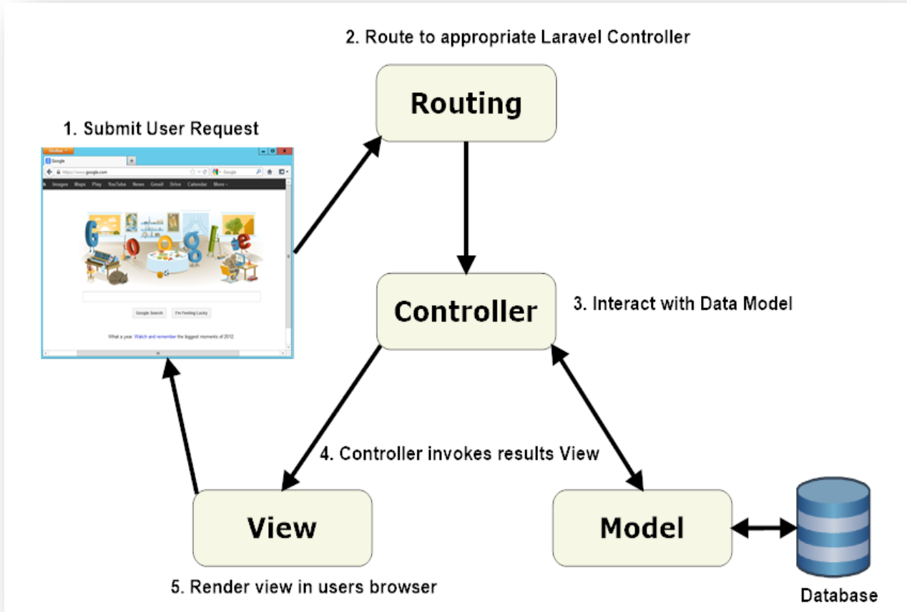
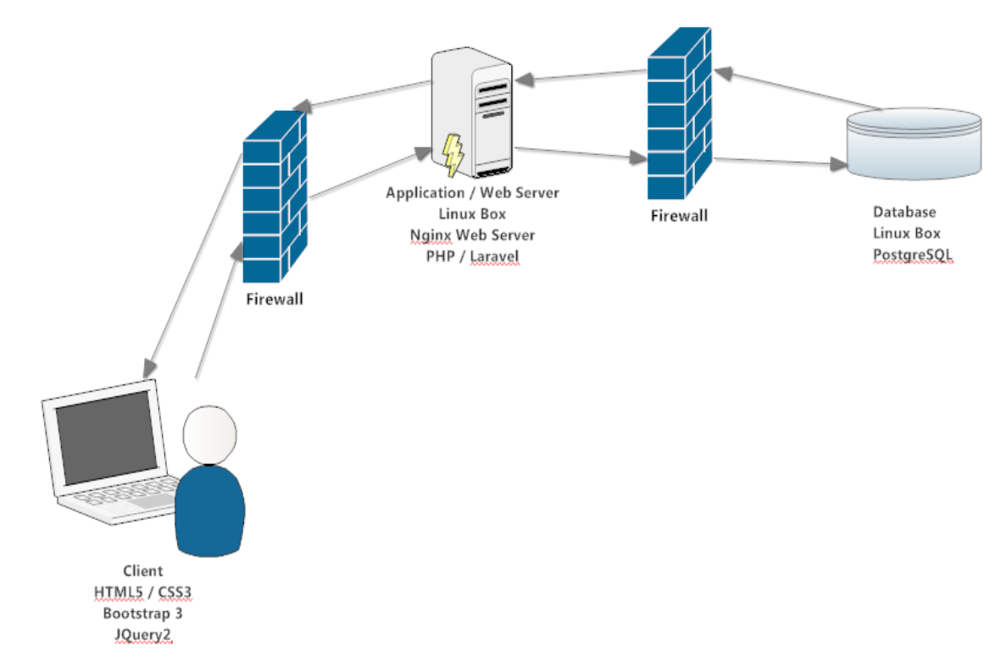

## Application Architecture

#### [Back](Application_Features.md) |     [Home](Index.md) |     [Next](System_Requirements.md)

**Sections:**

- [System Architecture](#system-architecture)

* * * 

This application platform is based on the MVC (Model View Controller) framework provided by Laravel. Laravel is a “Full Stack” framework and handles everything from serving web requests to generating HTML. Laravel provides extensive documentation on the framework and this can be obtained at http://laravelbook.com/laravel-architecture/. Below is a high-level overview of how the framework works.

**Figure 2: Laravel Architecture**

### System Architecture

The system architecture is a three-tier, distributed-client server model. The client is a relatively thin client with minimal JavaScript and JQuery executing in the browser. The application server is built using the Laravel framework on top of PHP. The data layer is a PostgreSQL relational database system, logically separate but physically on the same Linux server as the application server which serves up its HTTP responses from an NginX web server.

**Figure 3: System Architecture**

***

#### [Back](Application_Features.md) |     [Home](Index.md) |     [Next](System_Requirements.md)

