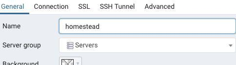
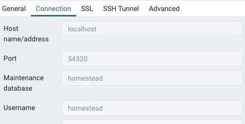
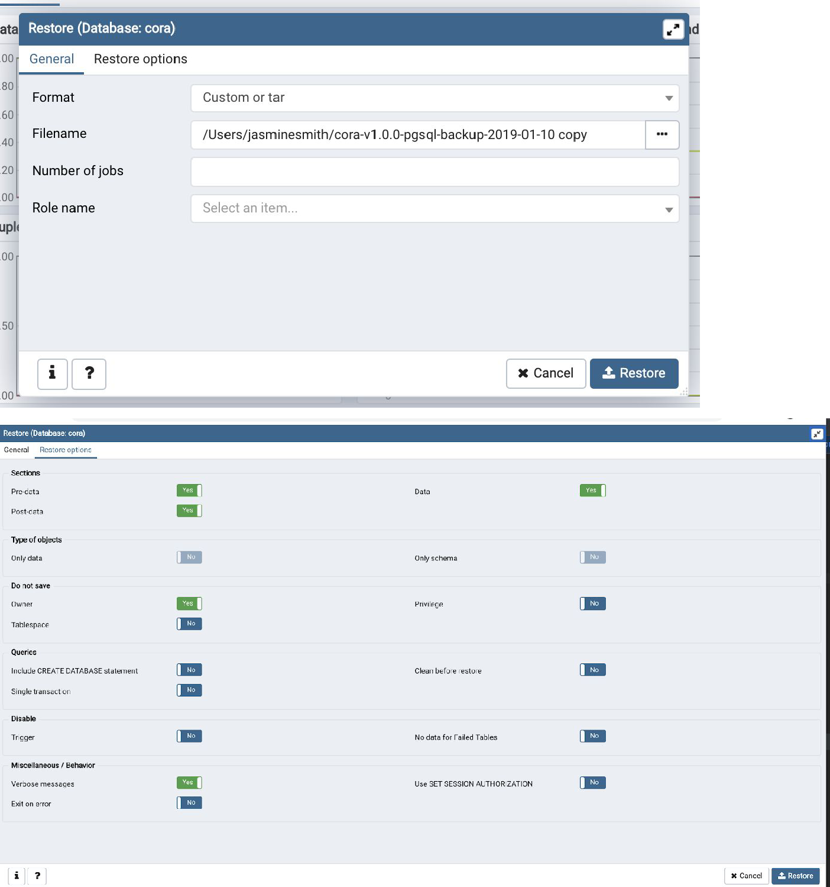
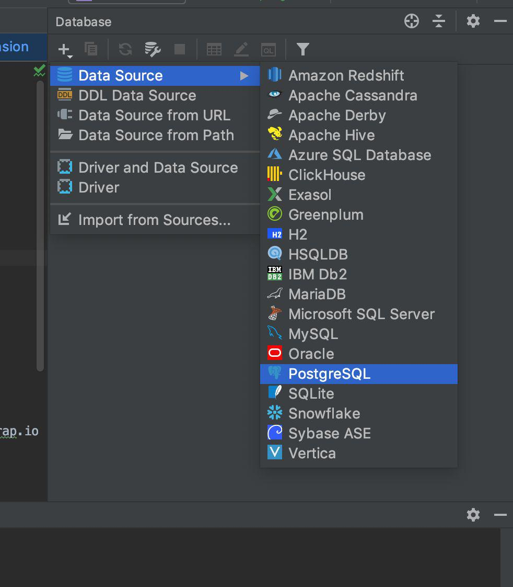
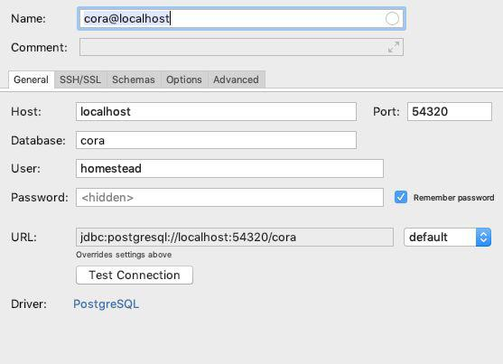

Cora Project Installation
=========================

#### [Back](Database_Design.md)  |     [Home](Index.md) |     [Next](Infrastructure_Setup_and_Configuration.md)


This document outlines the steps required to install CoRA project in
your local machine.

(*If you are using Windows, you may need to enable hardware
virtualization (VT-x). It can usually be enabled via your BIOS. If you
are using Hyper-V on a UEFI system you may additionally need to disable
Hyper-V in order to access VT-x.)*

1.  Install PhpStorm

2.  Download Virtual Box - <https://www.virtualbox.org/wiki/Downloads>

3.  Download Vagrant - <https://www.vagrantup.com/downloads.html>

    (You can check the vagrant version installed through the command
    "vagrant --version")

4.  Install the Laravel Homestead Vagrant Box -- You can install the
    homestead vagrant box by running the below command in your terminal

    **Command** - 
    ```bash
    vagrant box add laravel/homestead
     ```
     (Double check to see if the vagrant box has installed in your computer
    or not by typing in the command "vagrant box list" in your command line)

5.  Installing Homestead

    - Clone the Homestead

        **Mac**:
         ```bash
        "git clone https://github.com/laravel/homestead.git ~/Homestead"
        ```
        **Windows**: <br>
        Home Directory
        ```bash
         "git clone https://github.com/laravel/homestead.git" 
        ```

        (*Consider cloning the repository into a Homestead folder within
        your \"home\" directory, as the Homestead box will serve as the host
        to all of Laravel projects*)

    -  You should check out a tagged version of Homestead since the master
    branch may not always be stable: cd into Homestead \"\~/Homestead\"

        ```bash
        git checkout release
        ```

    - Create the Configuration file for the Homestead Box. cd into
    Homestead \"\~/Homestead\"

        Mac / Linux / Git Bash:
         ```bash
         init.sh
         ```
        Windows: 
        ```bash
        init.bat
        ```

      The above commands will create the "Homestead.yaml" file.

6.  Clone the cora project repository from GitHub (contact Professor
    Pawaskar for access)

    -  Find the location on your computer where you want to store the
    project
       
        Recommended (~/code)
    
        Windows: Home Directory/code
       
    -  Go to GitHub and get the https link from the "clone or download"
    button on the project

        Run this Command:​
        ```bash
        git clone https://github.com/SachinPawaskarUNO/cora2.git
        ```
7.  Configuring Homestead.yaml

    - Generate SSH Keys through below command in /Homestead if it is not
    generated
        ```bash
       ssh-keygen -t rsa -C \"you\@homestead\"
        ```
    - If you have put your folder in somewhere other than in a "code"
    folder on your local machine, then you will have to change the map
    section of folders to match the ​path on your local machine
  
    - Add cora to your databases in the same Homestead.yaml file

         ```bash
       folders:
            -map: ~/code
              to: /home/vagrant/code
    
        sites:
            -map: cora2.test
              to: /home/vagrant/code/cora2/public
    
        databases:
            -homestead
            -cora
         ```

8. Hostname Resolution

   The hosts file will redirect requests for your Homestead sites into
    your Homestead machine. <br>
    On Mac and Linux, this file is located at
    /etc/hosts.<br>
     On Windows, it is located at
    C:\\Windows\\System32\\drivers\\etc\\hosts

    Add the following line to the hosts file

    <b>192.168.10.10    cora2.test </b>

    Make sure the IP address listed is the one set in your
    Homestead.yaml file

9.  Launching the Vagrant Box

    Once you have edited the Homestead.yaml, run the following command
    from your Homestead directory (it might take some time when you do
    it for the first time)
    ```bash
     vagrant up
    ```

10. Log into your machine through the following command
    ```bash
     vagrant ssh
     ```
    Remember: Every time you edit something in the Homestead.yaml file,
    you must run the command
    ```bash
    vagrant reload --provision
    ```

11. When the vagrant is up and running, cd into the project
    ("vagrant\@homestead:\~/code/cora2\$") and run the below commands
    ```bash
    composer install 
    php artisan key:generate
    cp .env.example .env
    ```

    When everything is installed, you can access the site via
    <http://cora2.test>
    
    (You might get some database error as you have not set up your database)
    
    Follow these steps for database setup

12. Change .env information which is under cora2

    ```bash
    APP_URL=http://cora2.test
    
    DB_CONNECTION=pgsql
    DB_HOST=localhost
    DB_PORT=5432
    DB_DATABASE=cora
    DB_USERNAME=homestead
    DB_PASSWORD=secret
    ```
13. Install PgAdmin 4 -
    ​https://www.pgadmin.org/download/
    
14. Launch pgadmin

    -   Right click on "Servers"

    -   Create -\> Server

    -   Set properties to match

    -   Password is "secret"

   

   

-   Expand databases, right click on Cora

-   Go to Restore..

    -   Add cora-v1.0.0... file (Change format on bottom right to ALL
       when looking for file)
        (*Note: Ask for the cora-v1.0.0 file from Dr. Pawaskar if you don't
        have it*)

-   

-   Post-data/data/Pre-data - Yes

-   Owner - Yes

<!-- -->

-   Hit Restore (a failed message is OK)

15\. Connecting your database in PhpStorm - download any missing driver
files needed





Password = secret

You should see the cora homepage after the database setup. To create
your own login contact Dr. Pawaskar.

-   To see the full installation guide:
    https://laravel.com/docs/5.8/homestead

#### [Back](Database_Design.md)  |     [Home](Index.md) |     [Next](Infrastructure_Setup_and_Configuration.md)
