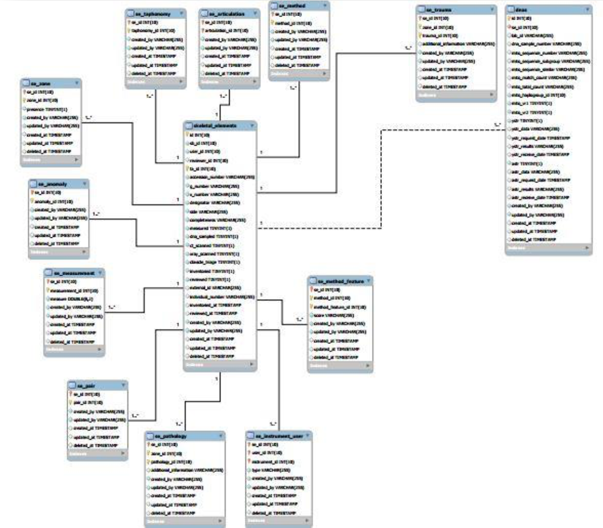
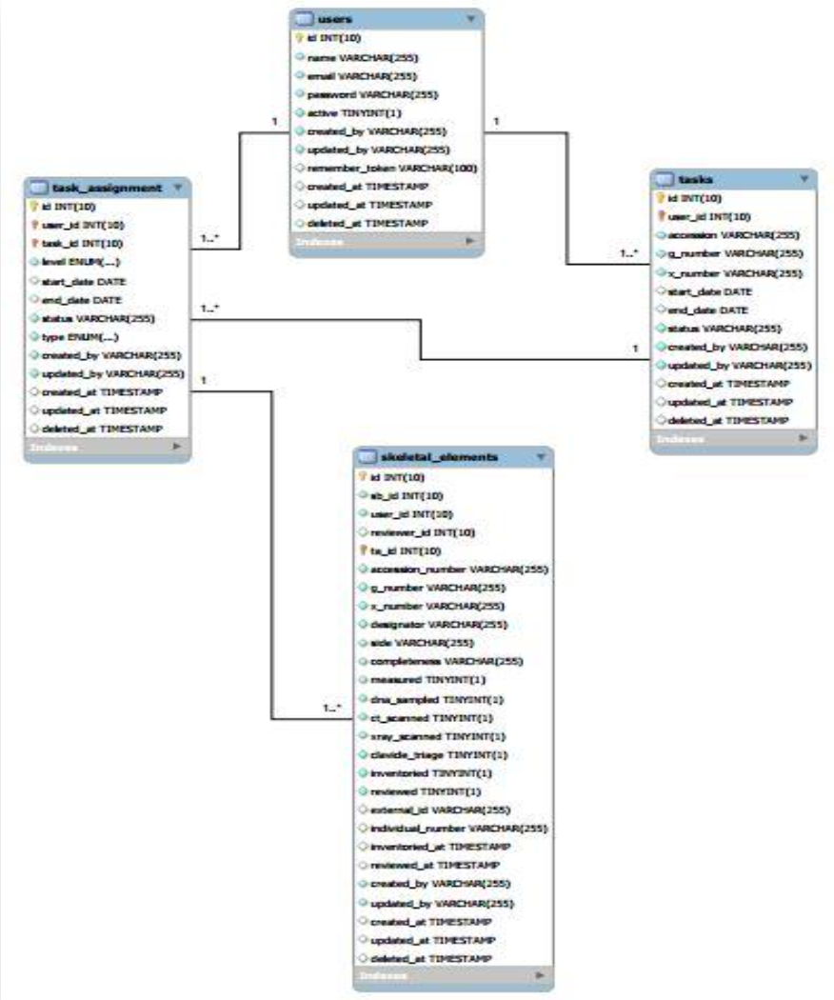
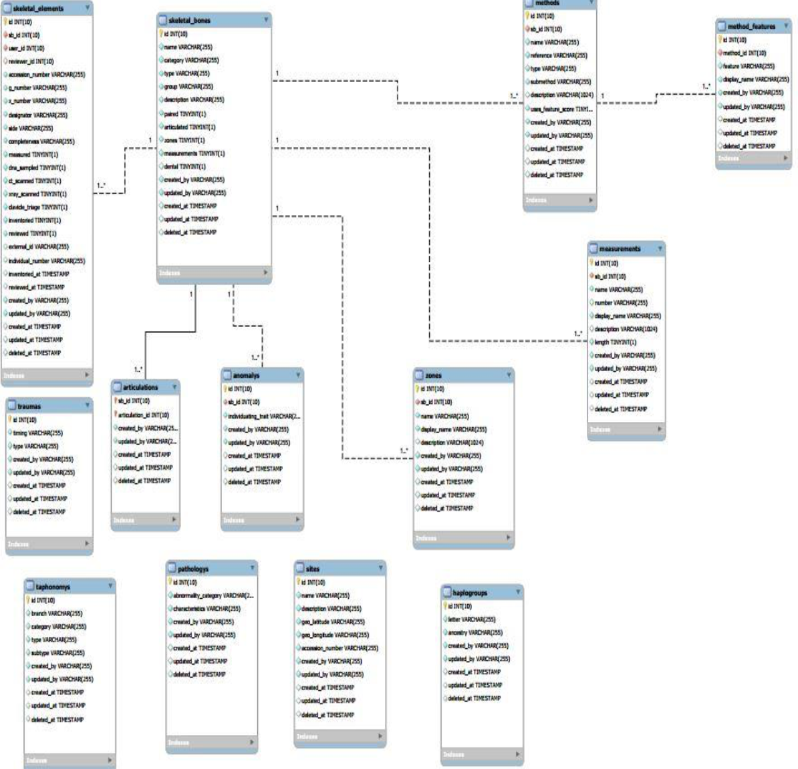

## Database Design

#### [Back](System_Requirements.md) |     [Home](Index.md) |     [Next](CoraInstall.md)

**Sections:**

- [Skeletal Elements](#skeletal-elements)

- [User Task Assignment](#user-task-assignment)

- [Skeletal Bone](#skeletal-bone)

* * * 

Database design is a process of generating a detailed data model of the database. This data model thus produced is comprised of all the needed logical and physical design choices and physical storage parameters needed to generate a design in a data definition language.

### Skeletal Elements

A physical database was created to support this application. As can be seen in Figure 4, there are thirteen tables in the design below. The list of these tables and supporting information can be found under the glossary.

**Figure 4: Skeletal Elements Database Design**

### User Task Assignment

A physical database was created to support the workflow management feature in the application. As can be seen in Figure 5, there are four tables in the design below. The list of these tables and supporting information can be found under the glossary.

**Figure 5: User Task Assignment Database Design**

### Skeletal Bone

A physical database was created to support this application. As can be seen in Figure 6, there are thirteen tables in the design below. The list of these tables and supporting information can be found under the glossary.

**Figure 6: Skeletal Bone Database Design**

***

#### [Back](System_Requirements.md) |     [Home](Index.md) |     [Next](CoraInstall.md)