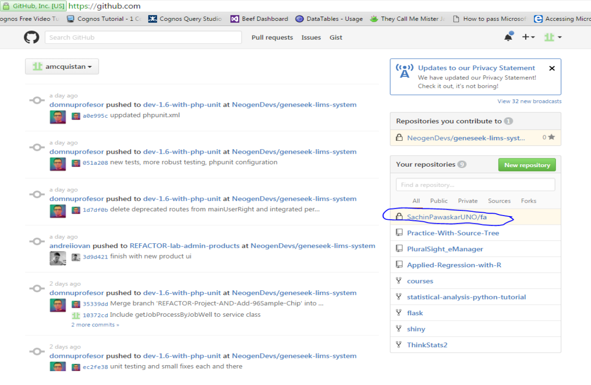
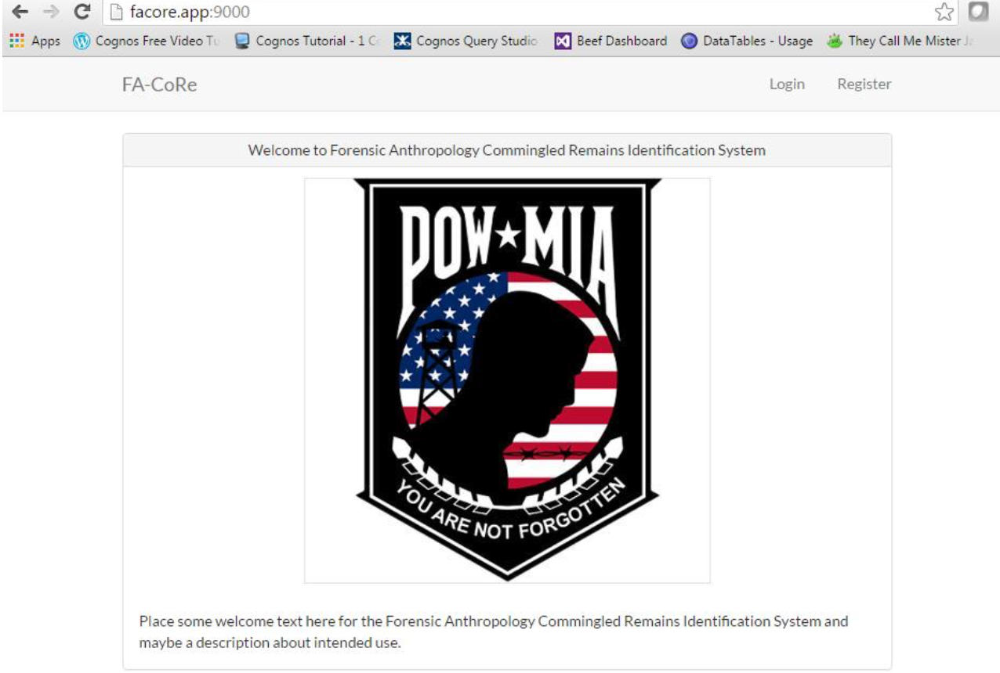

## Infrastructure Setup and Configuration

#### [Back](CoraInstall.md) |     [Home](Index.md) |     [Next](Setup_of_Local_Enviroment_for_Testing.md)

**Sections:**

- [Source Control Management Setup](#source-control-management-setup)

- [Installing Project Dependencies with Composer](#installing-project-dependencies-with-composer)

- [Setting Up Clean URL with a Virtual Host](#setting-up-clean-url-with-a-virtual-host)

- [Configuring Laravel to work with PostgreSQL](#configuring-laravel-to-work-with-postgresql)

- [Running Database Migration](#running-database-migration)

- [Running php artisan Migration](#running-php-artisan-migration)

- [Accessing the Application](#accessing-the-application)

- [Server Setup and Configuration](#server-setup-and-configuration)

* * * 

The purpose of this section is to describe the infrastructure setup implemented to host and develop the CoRA application outside of the POW/MIA network. The selection of the infrastructure was done in collaboration with POW/MIA’s technical staff and recommended approaches.

### Source Control Management Setup

GIT was selected for management of both the application and database related code. The decision was based on GitHub native integration (GitHub, 2016) with GIT as the deployment tool to their platform. Both Subversion and Concurrent Versions System (CVS) open Source Code Management (SCM) tools were also evaluated. A cloud solution, “Heroku,” was chosen to host the GIT repository. The selection was based on ease of use, price, academic licensing, and integration capabilities with other tools such as Yodiz.

The team source repository URL is: https://github.com/SachinPawaskarUNO/fa

The following steps describe the process used to setup a GitHub application repository on the server:

   * Sign up for free account using email address from the link: https://GitHub.com
   * To get more information on GitHub, please click [here](https://help.github.com/articles/set-up-git/)
   
#### What is Github? 

Git is a free and open source distributed version control system designed to handle everything from small to very large projects with speed and efficiency.

More information can be obtained at https://help.github.com/articles/set-up-git/

#### What is Source Tree? 

Source Tree is a GUI (Graphical User Interface) used for version control that emulates Git commands such as cloning, branching, merging, pushing and, pulling. For more information, please click [here](https://www.youtube.com/watch?v=1lBdlh3AGSc).

#### Cloning the Repository

To clone a repository, go to GitHub and click on the repository you wish to pull down as shown in Figure 7.



**Figure 7: Cloning a Repository on Git**

Select “Clone” or “Download” then copy the path to the Git repository. 


**Figure 8: Cloning or Making a New Repository on Git**

Open “Source Tree” and click on “Clone/New” then paste the URL (Uniform Resource Locator) to the Git repository as shown in Figure 9.


**Figure 9: Creating or Cloning a Git Repository**

Select the browse button to the right of the destination path and navigate to the hosting directory of WAMP (the www folder) and make a new folder inside it named facore, select it and click the “Select Folder” button.


On the “Clone / Add / Create” Repository click the “Clone” button as shown in Figure 10.


**Figure 10: Cloning the Git Repository**

Once the Source Tree pulls down the code set, you will see a newly cloned repo on the last navigation bar and panel with the heading “facore,” with sections labeled File Status, Branches, Tags, and Remotes.

#### Creating a Branch and Establishing Branch Naming Conventions

Expand Remotes and origin. Right click on “Develop” and select Checkout “Origin/Develop” as shown in Figure 11.


**Figure 11: Checkout to Origin/Develop Branch**

The Develop Branch will now show up under BRANCHES to indicate that the Branch has been cloned to your local Git environment.

#### Naming Convention of Branches

The convention followed for our Branches is as shown in Figure 12.

“INVESTIGATE|FEATURE|BUG- yourFirstInitialAndLastname- short-description-of-intentions”

**First Part:** We used INVESTIGATE, FEATURE, or FIX in all CAPS. This was to indicate the kind of work undertaken.

**Second Part:** We used first initial of first name and full last name to track the user working on the Branch. 

**Third Part:** In this part, we specified a short description of what we worked on.


**Figure 12: Naming Convention used to Create Branches**

### Installing Project Dependencies with Composer

##### What is Composer?

  * “Composer is a tool for dependency management in PHP. It allows you to declare the libraries (such as Laravel, entrust, phpunit, etc.) your project depends on and it will manage (install / update) them for you”
  
  * Please refer to the composer documentation in this [link](https://getcomposer.org/doc/00-intro.md) for more information.
  
##### Installing the Dependencies for our FACore Source Code

  * Open a command prompt. This can be done using either Git Bash or CMD (Command Line Interface).
  
  * Change directory into the facore directory as shown in Figure 13.
  


**Figure 13: Navigating to Desired Folder in Git Bash**

The Directory has to be displayed in order to make sure the user is inside the root of the Laravel facore project. It should look like what you see in Figure 14. Please note that the command for CMD is “dir”, whereas it is “ls –l” for Git Bash.


**Figure 14: Displaying the Directory in Git Bash**

Note that there is a file “composer.json” this is where all the packages for the project are specified. This file should not be edited unless instructed to do so.

Run the following command 
``` bash
composer install 
``` 
in order to install a long list of dependencies for the project. This will invoke dependencies as shown in Figure 15.


**Figure 15: Installing Composer Dependencies Using "Composer Install"**

The installation process is done when the message “Compiling common classes” is seen as shown in Figure 16.


**Figure 16: Success message upon installation of Composer**

### Setting Up Clean URL with a Virtual Host

##### Making a Virtual Host

  * Within your Wamp Directory navigate to the following directory:
  “Wamp/bin/apache/apache2.4.18/conf/extra”
  
  * In the “httpd-vhost-conf” file add the following. Please note that most of the users need to start from C Drive and not E Drive as shown in Figure 17. This is since the port is likely to be different for different users.
  


**Figure 17: Setting up clean URL with Virtual Host**

##### Updating the Hosts File

   *  In C:/Windows/System32/drivers/ect/hosts add the following as shown in Figure 18 in order to be able to access the front controller of Laravel’s public directory cleanly from using the name of the Application.


**Figure 18: Updating the Hosts File**

### Configuring Laravel to work with PostgreSQL

##### PostgreSQL
PostgreSQL is a powerful, Open Source object-relational Database system.

More information can be found [here](https://www.postgresql.org/about/).
  
  * **.Env File Configuration:** Historically, Application configuration has been coupled to the Application by placing them directly in the source code. In this application we placed the majority of the configuration values such as Database connection parameters in a single non-executable configuration file known as the environment (.env) file which is located in the Application root Directory.
    
    This is not a file the users will be pushing to Source Control because everyone working on the project will likely have different passwords and potentially different ports for Postgres. In fact, when code is pulled down the source code there will not be a .env file.

  * Using either notepad++ or note pad create a file “.env” in the application root and page the below into the file. For DB_DATABASE the Database you created must be used. (See next step), for DB_USERNAME and DB_PASSWORD use the same as that of PostgreSQL as shown in Figure 19.


**Figure 19: PostgreSQL Setup**


**Figure 20: Storing ".Env" File in Project Directory**

##### The Laravel config/database.php file

  * Under the Config Directory open the database.php file and change the name for the default database connection name to “pgsql” as shown in Figure 21.
  


**Figure 21: Laravel Config File Configuration**

##### Additional php.ini configurations to be enabled

  * In the bin Directory of Wamp open the php folder, then php 7XX. Find the php.ini config File and open it as shown in Figure 22.
  


**Figure 22: PHP .ini File Configuration**

  * Uncomment extension=php_pdo_pgsql.dll and extension=php_pgsql.dll as shown in Figure 23.
  


**Figure 23: Uncommenting Files Specified for PHP .ini File**

These steps are to be followed after the configuration of php.ini File:

  * Restart the Wamp services
  * Create the Database in Postgres Admin UI
  * Open up postgres admin console as shown in Figure 24.
  


**Figure 24: PostgreSQL Admin Console**

  * Expand the servers tree on the left then enter your password
  * Right click on Database, mouse over Create and click “Database” as shown in Figure 25.
 


**Figure 25: Creating a new Database in PostgreSQL**

  * Name the Database “facoredb” and click “save” as shown in Figure 26.
  


**Figure 26: Creating and Saving Database in PostgreSQL**

### Running Database Migration

#### What is a database migration?

Laravel’s documentation says it best, “Migrations are like version control for your database, allowing a team to easily modify and share the application's database schema” (Laravel, Database: Migrations). When working with an Application as a team there is two things that you must be able to manage.

  * The changes to the source code.
  * The changes to the database.
  
Development frameworks have grown to include significant functionality in recent years to accommodate these changes. Laravel has a pretty sophisticated migration system useful for the initial development phase.

#### Where are migrations located?

  * Every time a Migration is made to represent a change to the Database schema it should begin with using Laravel’s artisan command line tool to track the change so that all team members can keep up to date with the latest great features.
  
  * Migrations are simple php scripts that handle DDL (Data Definition Language) commands in a Database agnostic manner. They are stored in the Laravel Directory “database/migrations” as shown in Figure 27.
  


**Figure 27: Migrations under "database/migrations" Folder in Project Directory**

### Running php artisan migration

  * "Artisan is the name of the command-line interface included with Laravel. It provides a number of helpful commands for your use while developing your application. It is driven by the powerful Symfony Console component” (Laravel, Artisan Console). Artisan is incredibly useful for automating or scaffolding different features of the Laravel framework such as controllers, models, migrations, and a really useful feature called tinker that allows the developer to interactively test PHP/Laravel commands.
  
  * To get the facore project migrations up to date navigate to the root of the project and run the following command 
      ``` bash
      php artisan migrate
    ``` 
as shown in Figure 28.
  


**Figure 28: Running the "php artisan migrate" command in the Project Root Directory**

### Accessing the Application

  * Navigate to http://facore.app:xxxx (where XXXX is your Wamp port) and push enter to send the GET request to the server and voila, it should respond with the page show in Figure 29.
  


**Figure 29: Accessing the Application**

#### Seeding the Data through Migrations

This is achieved by using the command 
```bash
Php artisan migrate-refresh –seed
```
 This will roll back the previous migrations, rerun them to tear down and rebuild the database. Then the seed classes will be called to fill the database with seed data. The output of the command is shown in Figure 30.


**Figure 30: Seeding the Database**

Then you can log into the system using username: faadmin@unomaha.edu and password: powmia

This should give you full access to the site on your local environment.


### Server Setup and Configuration

The team is using Heroku Cloud for the server platform and testing environment. The steps to deploy the application on Heroku are specified in System Migration and Configuration provided at the end of the document. To get more information on Heroku, please click [here](https://devcenter.heroku.com/articles/getting-started-with-php#introduction).

Steps to Setup the Server are:

1. Sign up for Heroku. This can be done [here](https://signup.heroku.com/?c=70130000001x9jFAAQ).
2. Select “Create a New App” [here](https://dashboard.heroku.com/auth/heroku/callback?!=&code=86a6d020-607b-4a7a-9c95-f61befec3b10).
3. Select App name on the screen and select United States on the Runtime Selection.
4. Click on “Deploy” Icon and Click on “Connect to GitHub” under “Deployment” Method after
keying in GitHub credentials when asked as shown in Figure 31.
5. Scroll down to Connect to GitHub and your GitHub account should be read and displayed on the
screen. Type your repository name and click Search. Your repository should be displayed. Click Connect.


**Figure 31: Setting up Server and Deploying the Application**

6. Your repository on GitHub shall be connected to Heroku as shown in Figure 32.


**Figure 32: Connecting to Github**

***

#### [Back](CoraInstall.md) |     [Home](Index.md) |     [Next](Setup_of_Local_Enviroment_for_Testing.md)

