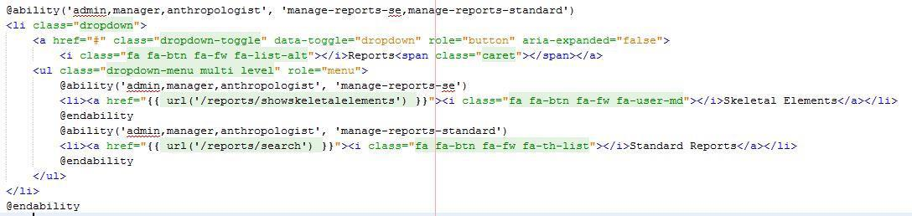
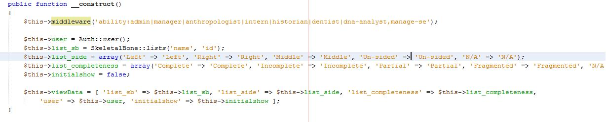

## Security Design and Configuration

#### [Back](Setup_of_Local_Enviroment_for_Testing.md) |     [Home](Index.md) |     [Next](System_Migration_and_Configuration.md)

Role based access control (RBAC) Authentication in this application is achieved by using Role based access control 
which is a method of regulating access to the application based on roles of the users. This application has been 
designed in such a way that only users with sufficient roles and permissions can access the system. Also, there are 
strict prohibitions on few screens of the application. These are limited to Admins and Managers of the system.

To achieve this functionality throughout the application, we have used MIT based RBAC ‘Entrust Package’ which 
is available through GitHub https://github.com/Zizaco/entrust upon licensing.

### Implementing Entrust package within the application:

Steps to be followed to achieve role based access control are clearly mentioned on the readme file available in the 
Entrust package https://github.com/Zizaco/entrust.

**Tables that are created in the implementation process are:**

**Roles** — stores role records

**Permissions** — stores permission records

**role_user** — stores many-to-many relations between roles and users

**permission_role** — stores many-to-many relations between roles and permissions

### Standard used for naming the permissions:

There are different permissions which are used across the application. Every other permission is dependent on manage 
permission and hence each permission should be preceded with a manage permission.

**Eg: Manage-anomalys + create-anomalys**

### Different Permissions used in the Application:

**Manage:** A user who has been given this permission would only be able to see the index page and view page of the 
respective screen.

**View:** Very similar to the manage permission but manage is a base permission where other permissions shall 
not work without giving manage in the first place.

**Create:** A user who has been given this permission would only be able to see the index page, view page and 
also add new items onto the database of the respective screen.

**Edit:** A user who has been given this permission would only be able to see the index page, view page and also 
edit existing items on the database of the respective screen.

**Delete:** A user who has been given this permission would only be able to see the index page, view page and also 
delete existing items on the database of the respective screen.

Entrust package offer multiple syntaxes for a respective type of file. For all the blade files, view files 
essentially we have used ‘ability’ function as shown in Figure 46 to block access except for specified roles

and permissions

**Figure 46: Using Entrust Conventions in Code**

Admin, Manager and Anthropologist are different roles and manage-reports-se, manage-reports-standard are permissions.

**Syntax used on controller files:**

**Figure 47: Syntax for Controller Files**

The same ‘ability’ has been used to call middleware for authentication purposes.

***

#### [Back](Setup_of_Local_Enviroment_for_Testing.md) |     [Home](Index.md) |     [Next](System_Migration_and_Configuration.md)