
# TESTING MANUAL FOR  CORA25

## Purpose

The purpose of this document is to describe the key configurations and specifications used to test the existing Commingled Remains Analytics (CoRA) web application for the Defense POW/MIA Accounting Agency (DPAA). The document will provide a clear understanding of 1) how to set up the system/application locally, 2) configurations for the testing environment, 3) any potential issues that may arise for both API and UI testing, and 4)how to resolve common issues. 

 ## Terms and Definitions 
 
 **Terms used in this document shall have the following meanings:**
 
|**Terms**  | **Definition** |
|--|--|
|Postman  | Collaboration Platform for API Development. It is used for testing request/response calls to APIs. |
|Workspaces  | Workspaces in Postman allow collaboration with team members to work together in testing and developing the required APIs. |
|Environments  | Environments in Postman allow us to group the commonly used variables, tokens, and URLs to be in a single environment. We can create multiple environments in Postman for production, development, etc. |
|Collections  | Postman collections are used to group the different API requests into different collections.|
| Variables  | Variables are used to store and retrieve the values associated with them and can be used in multiple requests. Postman allows using variables at different scopes. Available scopes in Postman include environment variables, global variables, collection variables, and local variables. |
|Collection runner  | Used to run an entire collection of requests at once. The collection runner also allows us to run the requests in specified sequences.  |
| Postman console  |  The console is used for debugging requests. The Postman console logs all the request headers, authorizations, proxy settings, network configurations, request parameters, and payloads associated with a particular request. This helps to troubleshoot the request and to ensure correct data is being returned in the response.|

## API Testing

API testing for the Commingled Remains Analytics (CoRA) web application was done using a testing tool called Postman. The following sections describe how API testing was performed using the Postman application.

## Postman Installation

Postman is available as a desktop application or a web application. The application can be downloaded from this link: 
[Download Postman Application](https://www.postman.com/downloads/)

After downloading the application, click on the .exe file to install the Postman application.

#### Hardware requirements 
**Windows**

The minimum requirement to run postman in a Windows environment is Windows 7 or higher.

**Mac**

The minimum requirement to run Postman in a Mac environment is Yosemite (macOS 10.10).

**Postman on web browser**

Postman can also be used directly from a web browser. Use this link for the Postman web browser:
[Postman web browser](go.postman.co/build)

**Note:**
- It is recommended to use the desktop application for testing and developing APIs.
 -  An additional Postman agent extension is required to run Postman from a web browser. 
 - Additional headers are also required to test the requests or else a CORS (Cross-origin resource sharing) error will occur.
 -  You can read more about the postman web browser and its limitations [here](https://blog.postman.com/introducing-the-postman-agent-send-api-requests-from-your-browser-without-limits/)

## Postman Application Setup

Before testing existing requests or adding new requests, you will need to set your workspace and environment correctly for the requests to work. Below are the steps required to set up the Postman application for CoRA testing.

**Workspace**

We have used the Cora API Testing Team workspace for testing and developing the APIs. 
You can change or join different workspaces by selecting the dropdown menu at the top of the application. 

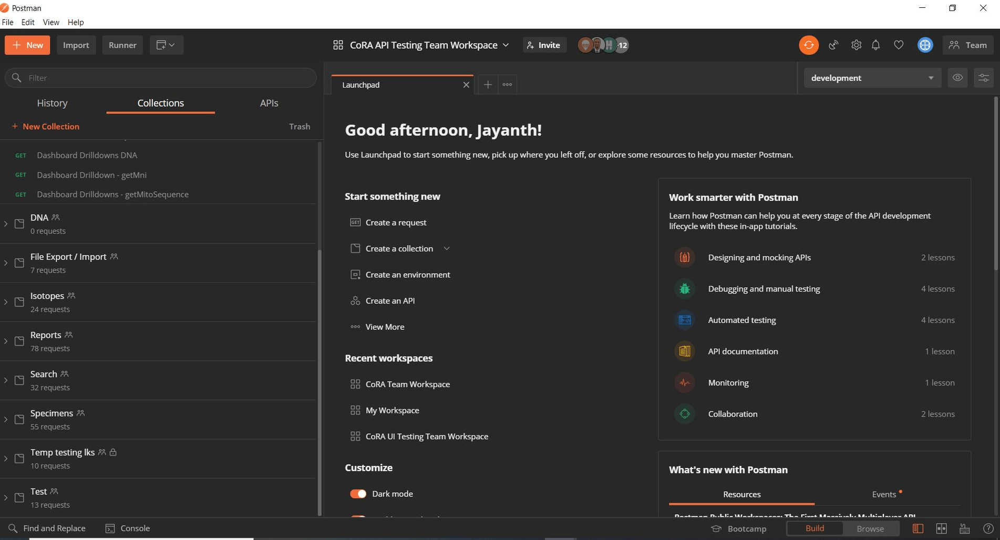

**Environment**

There are two environments in this workspace that are already created for testing the CoRA application: Development and Local. You can switch between the environments based on testing requirements. 

We have used the Development environment for testing. You can switch to other environments by selecting the drop-down menu at the top right of the application.

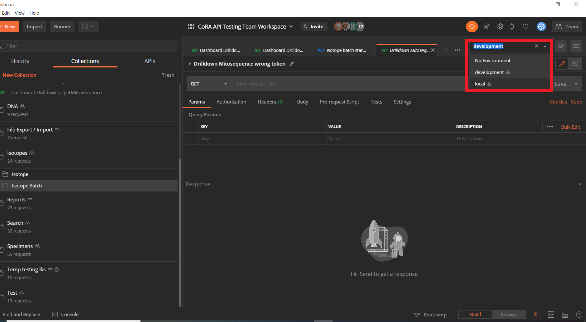

Commonly used URLs, tokens, and variables are already defined as environment variables in their specific environments, and you can use these variables in your requests.
You can see the environment variables by clicking the "Eye" icon at the top right corner of the application.

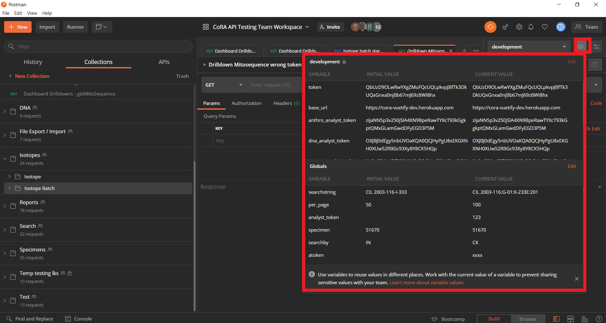

**Collections**

Collections are used to group the requests together. We have created collections based on epics. You can create multiple collections with additional layers (i.e., subfolders) within each collections.
Within each collection, we have a folder for each user story. 

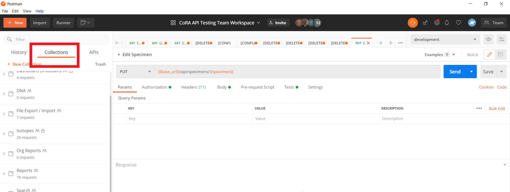

 - **Creating collections**
		 You can create the collections by clicking the "New" button at the toolbar on the top of the application. In the popup window, you will have options to create new collections, requests, and environments. Click on "Collections", which will open another popup window where you are required to provide a name and an optional description of the collection. Then click on the "Create" button at the bottom of the window.
		 You can also create new collections by clicking the "+new collection" at the top of the sidebar.
		 
	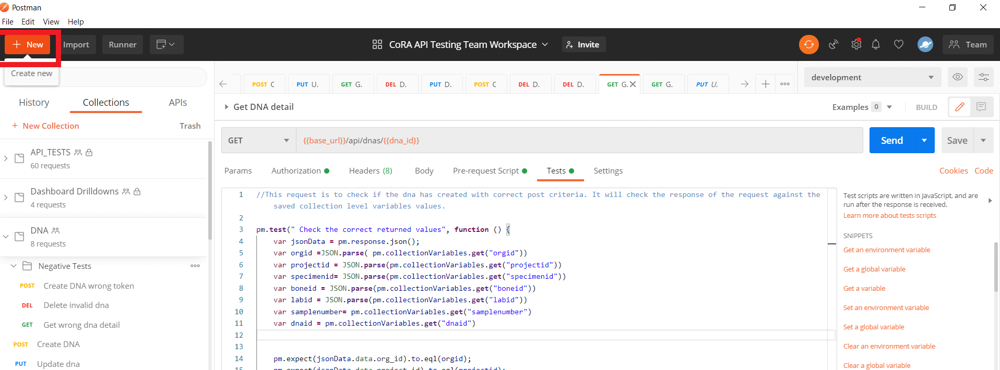
		 
 - **Adding  requests to collections**
	 You can add requests to a collection by clicking the same "New" button at the top of the toolbar and clicking on "Request" in the popup window. After giving the name of the request, you can save the request in the required collection.
	 You can also create requests by clicking on the "Actions" button to the right of the collection name, where a dropdown menu with multiple action items will appear. Then click on "Add Request" to create and save the request in the collection.
	 
	 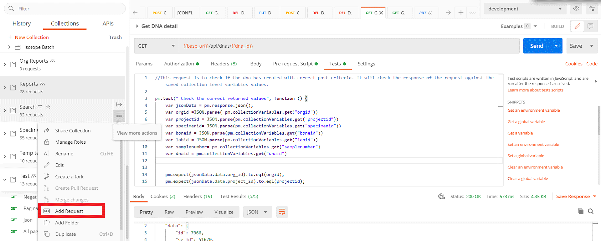
	 

## Variables in Postman 

**Variables**

Variables are used to store, access, and reuse the values in requests and test scripts. Variables are very useful if using a single value multiple times in one or more requests. If the value of a variable needs to be modified,  it only needs to be changed in one place for the variable's scope. Variables are also used to pass data between requests, which makes the sequencing of requests more flexible. We have extensively used Postman variables in our requests and test scripts.

**Variable Scopes**

Postman allows using variables at different scopes. Choosing the scope depends upon the context of the requests. 
Postman allows the following scopes for variables.
	

 - **Global variables**
These variables can be accessed between the collections, requests, and environments. 
 - **Environment variables**
These variables are used to define URLs and tokens specific to an environment and can be used across an environment (e.g., development or local environment). 
- **Collection variables**	
These variables can be accessed within a specific collection and for requests within that collection.

- **Local variables**
These variables are temporary and are accessed within a single request test script and will not be available outside the request.
- **Data variables**
	These variables come from external data files, which are can be used while running a collection.
 
**Defining variables**
 There are two ways to create and edit the variables in Postman: Manually adding them, or defining them in the test scripts.
 
 **Manually adding variables** 
To manually add global and environment variables, click on the "eye icon" at the top-right corner of the application. Postman will open a popup window showing the existing environment and global variables. To create and edit these variables, click on the edit icon next to the environment or global variables and add the required variables as key-value pairs. After adding the variables, click on the "Update" button. This should create/edit the variables.

Environment variables	 
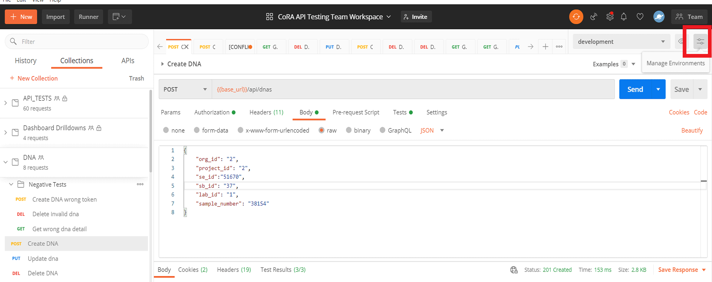

Global variables	 
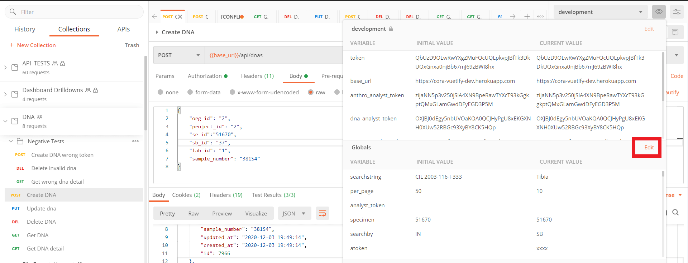
	 

To manually add the collection variables, click on the "Actions" button located on the right side of the collection name and select the edit icon from the dropdown menu. In the popup window, choose the variables tab and add the required collection variables. Then click on "Update" to save them.

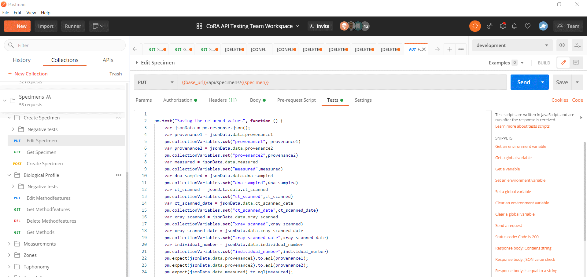

 **In Scripts**
 
We can create or edit the variables from test scripts using the following code snippets.

**For global variables**

    pm.globals.set("variable_key", "variable_value");
  
**For Environment variables**

    pm.environment.set("variable_key", "variable_value");

 
**For Collection variables**

    pm.collectionVariables.set("variable_key", "variable_value");

**For Local variables**

    pm.variables.set("variable_key", "variable_value");

 
**Accessing variables** 
Double curly braces are used to reference/access the variables. The following example syntax is used to access the created variables.

**Example**

    {{example}}

**Using in URL** 
	
    {{base_url}}/api/projects/2/specimens/search/?searchby={{searchby}}&searchstring={{searchstring}}&per_page={{per_page}}

 **Accessing in test scripts**

We can access the variables in test scripts by using the following code snippets.

**For global variables**

    pm.globals.get("variable_key");
  
**For Environment variables**

    pm.environment.get("variable_key");

 
**For Collection variables**

    pm.collectionVariables.get("variable_key");

**For Local variables**

    pm.variables.get("variable_key");

**Note**

 - Editor access is required to create or modify the variables in Postman. WIthout editor access, you can only see created variables.
 

## Postman Testing

**HTTP Methods**

There are many HTTP methods that can be used in Postman, but for this project, we have only used the following HTTP methods.

|  **Method**| **Description** |
|--|--|
| GET | Get is used to retrieve the headers and response data for the request.  |
| POST | Post is used to create a new resource with the given request payload.  |
| PUT | Put is similar to post, but it is used to update the resource. |
| DELETE | Delete is used to remove the resource. |

An example of positive and negative testing is shown in this manual. All other requests can be accessed through the shared CoRA API testing workspace in Postman. In this manual, we will show "Post specimen" (positive test) and " GET DNA reports with the wrong tokens" (negative test).

**Example**

 - **POST Specimen**
 
**Step 1:**
 Set the required HTTP method and add the required URL.
 
**Step 2:**
In the authorization tab, select the type as bearer token and specify the required authorization token value.

**Step 3 :** 
 In headers, add the content-type as application/json (only for Post and Put requests).

**Step 4 :**
 Add the body parameters (request payload) in raw JSON format.

**Step 5:** 
 If applicable, write the scripts which need to be executed before the request is sent.

**Step 6:** 
Add the required test scripts in the test tab of the request.

**Step 7:**
Once everything is set, hit the "Send" button. You should receive the response and status of test scripts. The test results tab will show how many tests have passed or failed.
 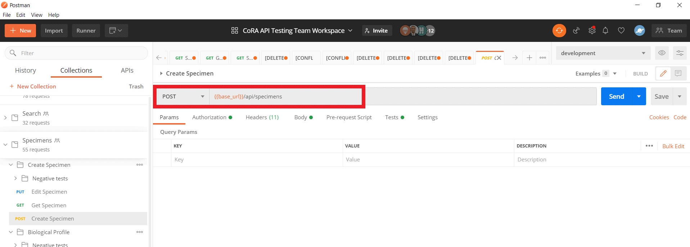

 - **GET Dna Report (Negative testing)**
 
**Step 1:**
Set the required HTTP method and add the required URL.

**Step 2:**
In the authorization tab, select the type as bearer token and specify the required authorization token value.  In this request, we are using a newly created global variable to test the invalid token values.

**Step 3 :** 
In headers, add the content-type as application/json (only for Post and Put requests).

**Step 4 :**
Add the body parameters (request payload) in raw JSON format.

**Step 5:** 
In the pre-request script in this request, we create global variables and set them to required values.

**Step 6:** 
Along with the general test scripts, we are adding If-Else loop logic to the request to loop through the array of values. For this, we are using the "setnextRequest()" function to all the same request multiple times.

**Step 7:**
The "setnextRequest()" function is a collection-level command, so using the "Send" button will not work in this case because the test script is set up to send multiple calls to the API. The Collection Runner must be used to run the request and check the response for this test script.
	 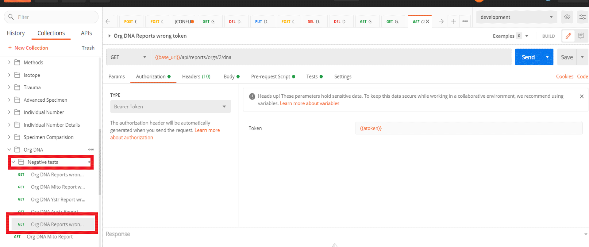

	   
		     
 **Collection Runner**
 The Collection Runner allows you to run the requests in a specific sequence. You can also run collections against different available environments. To run  a collection, click on the "Runner" at the top left of the application.  After opening the Collection Runner, you can see all the collections available in the workspace on the left side. Then you can select a particular collection and can see all available requests in that collection on the right side of the window. You can change the sequence of the requests by dragging them up or down as required. Set the environment required from the left side of the window. Optionally, you can set the number of iterations, the delay between requests, and other parameters before running the collection.
To run the Collections Runner, hit on the "Run Collection" button at the bottom of the window. This will open a new window. Postman will execute the requests in real time and provide the status of each request being executed. An overall summary of the passed and failed tests is shown after the end of the run. 
    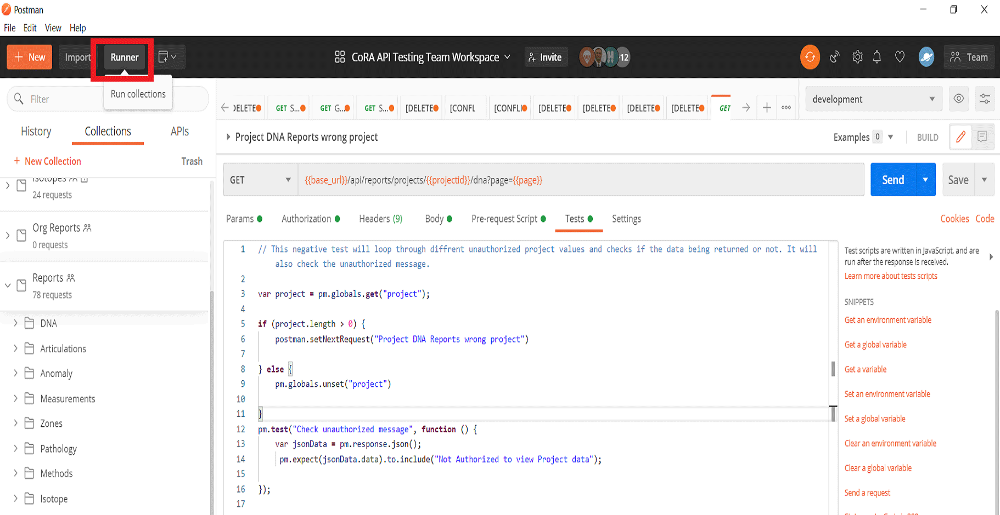

**Note:**
Sequencing of the requests can be also done using the Postman setnextrequest() function, which will specify what request will be run next. Learn more about building request workflows[here].(https://learning.postman.com/docs/running-collections/building-workflows/)
 
## Exporting data

We can export data from the entire collection by clicking on the "Action" button (three dots icon ... ) at the right side of the collection name and then clicking on "Export" from the dropdown menu. This opens up a popup window. Then click on the "Export" button and select the path to save the file in the required location.
    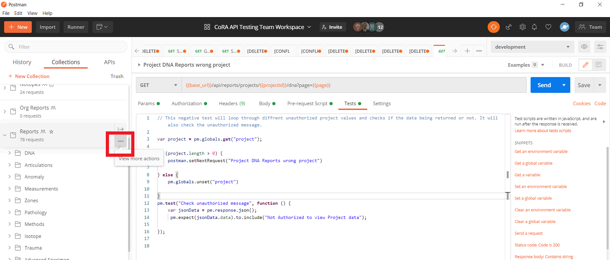

## Troubleshooting

**Postman console**

During testing, sometimes requests will not work as expected.  One of the best ways to troubleshoot requests is by using the Postman console. If there is an error in the request being sent, the error message and link to the console can be seen in the response body. Clicking on this link will open the Postman console. You can also access the Postman console from the view in the toolbar, which is located at the top of the application.

The Postman console can be also used to debug requests. Every request which is sent via Postman will be logged in the Postman console. You can use the "console.log()" statement in the test scripts at multiple locations to log required information to see how the required parameters are being sent from Postman and for general debugging purposes.
    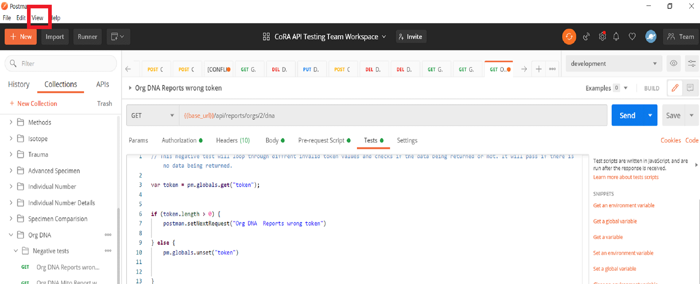

**Common Issues**

- **Invalid urls**

	Using invalid or incorrect URLs in a request is a common issue in Postman. Double-check the URL and query parameters being sent if you are getting a 404 status code on the response. 

- **Environment check**

	Sometimes the environment in Postman changes to "no environment" after an update or after a restart of the Postman application. If this occurs, simply change it to the required environment to continue testing in Postman.

- **Status codes**

	Some of the client-side and server error codes that we often saw while testing in Postman are listed in the table below. 400-series response codes are client-side error codes, and 500-series response codes are server-side error codes.
	
| **Status codes** | **Description** |
|--|--|
|400  | Bad request - Invalid syntax or parameters |
|403  | Forbidden - Unauthorized to perform the request |
|404  | Not found - Invalid URL name|
|422  | Unprocessable entry - Invalid request payload|
|429  | Too many requests  - Sending multiple requests in a short amount of time|
|500  |Internal server error - an unexpected condition in processing the request  |
|503  | Service unavailable - Server down/unavailable|

## Postman Learning Resources

 

 - To obtain more information and the detailed workings of the Postman application, visit the Postman [Learning Center](https://learning.postman.com/docs/getting-started/introduction/). The Postman Learning Center has detailed documentation and examples on how to use Postman effectively.

- The Postman Learning Center provides a general overview of the application, but to get answers for specific questions, we recommend using the Postman online community to post a question and get answers from Postman core team members and other members of the [Postman Community](https://community.postman.com/).  

-  [The Postman blog](https://blog.postman.com/) also is a resource with more information on Postman tutorials, conferences, and news.

## References

 The Collaboration Platform for API Development. (n.d.). Retrieved December 02, 2020, from https://www.postman.com/

