# LARAVEL DUSK

## Purpose

Dusk is based on the open source tools ChromeDriver and Facebook Php-webdriver which makes it simple to use without the need to experience the intense procedure of setting up Selenium. This document is to help all the dusk users to perform User-Interface testing for the Cora Project.

## Why Dusk?

The purpose of using dusk over PHPunit testing is to overcome all the limitations of the unit testing.

One of the challenges of testing with PHPUnit was the inablity to test JavaScript based application functionality.

With Dusk the test is run in the browser so client-side features like JavaScript are testable.

One of Dusk features also inlcudes the ability to wait for a condition to be true at the frontend, before executing tests. For example it could wait for a JavaScript component or CSS selector to load before taking any action.

## Terms and Definitions 
 
 **Important terms and pages which are used more frequently throughout the manual**
 
|**Terms**  | **Definition** |
|--|--|
|Dusk  | A tool for Application Testing |
|Methods  | The command we provide to the browser for automation. |
|DuskTestCase  | One of the most important page, from where the web driver instance gets generated. |
|coraBaseTest  | Important page which holds the testaccounts for all the users to be called directly upon signin.|
| loginPage  | Page when login and logout functions are defined. |
|specimenPage  | Page where all the selector are registered.  |


## Installation
•If the system is not installed with php packages, we may have to install it. To check whether your system has it:  run the following command in your command line

```console
$ php -v
```
•Visit apachefriends.org/index.html and download php packages. (C drive recommended)

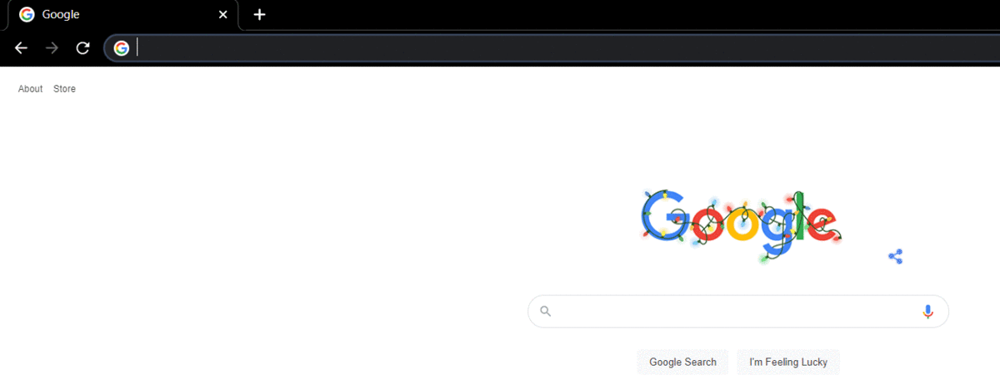

**setting up the environmental variable**

•Copy the path to xampp in file explorer.

•Add this path in the environment variables, by opening system’s environment variable settings and adding the path of xampp for user variables.

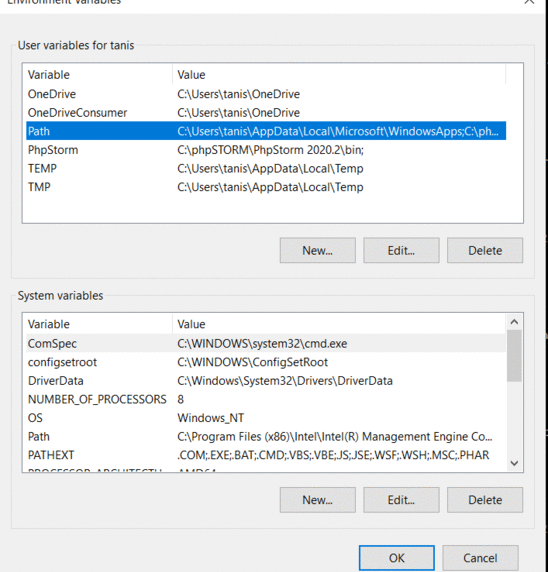

**Downloading Laravel packages**
•First, make your vagrant up & vagrant ssh (refer technical manual for this)

•Run command: from homestead

```console
$ composer require –dev Laravel/dusk
```

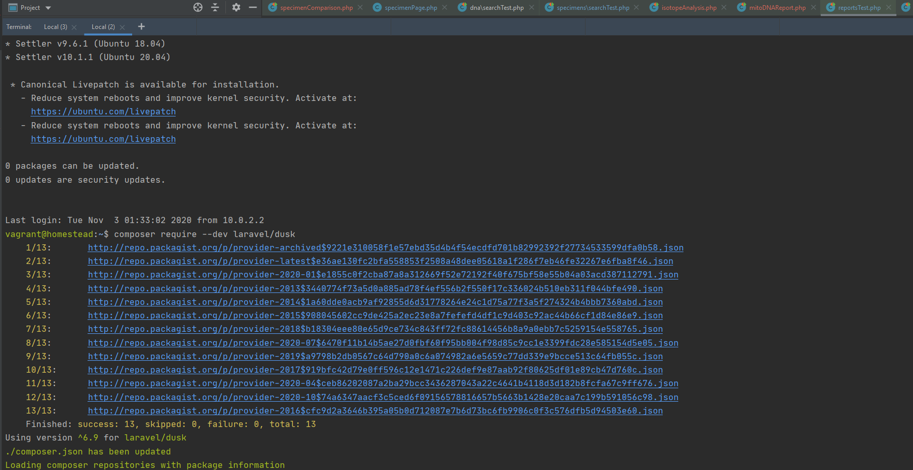

**Checking Laravel Framework version**

Run the following command from the cora25 folder.

```console
$ php artisan list
```

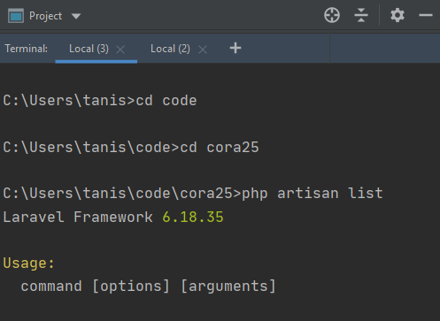

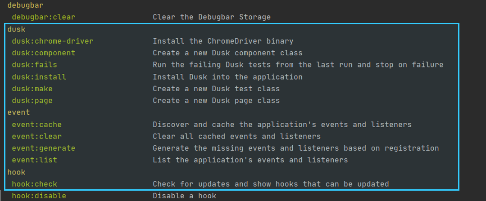


**Using the xampp control panel**

•You may get an error saying “php is not recognized as internal or external command”
In this case make sure you have followed the steps correctly for the php installation.
If still the problem occurs,
Open Xampp GUI and select “shell” to use Xampp interface. (note: use only if php storm does not recognize php)

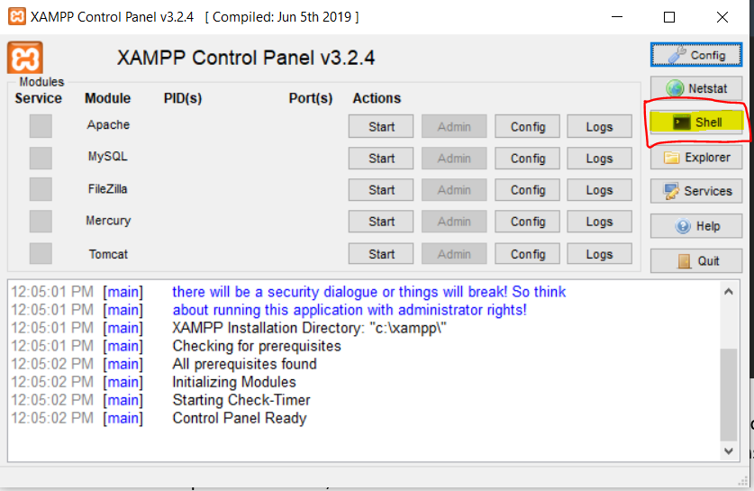

**Installing dusk to the project cora25**

```console
$ php artisan dusk:install  
```

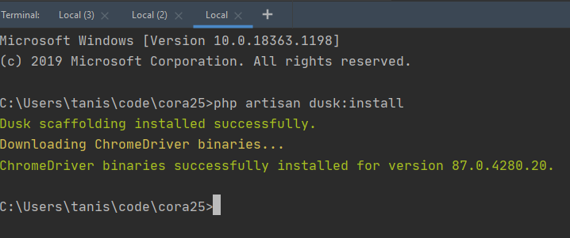

**Creating a new test file**

•Run the following command from the folder where the file needs to be added.

```console
$ php artisan dusk: make<space> <file name>  
```

**Hiding the browser**

•To make the browser visible while running a test
open the file “duskTestCase” and un-comment out the following line as shown, and to run the test without a browser appearing.


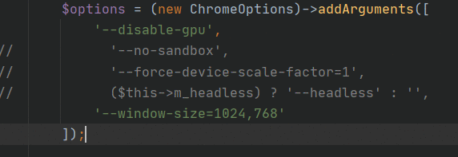

**Making the browser appear**

•To make the browser visible while running a test
open the file “duskTestCase” and comment out the following line as shown, and to run the test without a browser appearing


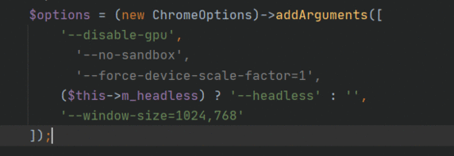

**DuskTestCase & coraBaseTest**

•Every class must extend to DuskTestCase. Here coraBaseTest page holds login account credentials which extends to DuskTestcase, therefore every test page for cora project extends to coraBaseTest. 


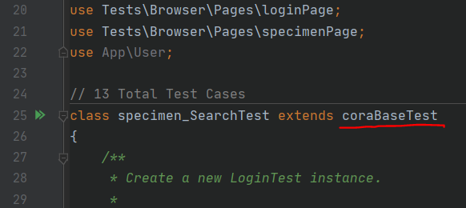

**User Authentication**

- **Changing Login User**

TestAccounts are defined for every cora user in coraBaseTest page, changing the name for the account makes every test enter credentials for that particular user.

<strong><em>$user = $this->testAccounts[‘’anthro-Analyst’’];</em></strong>

- **Understanding and calling the loginPage**

LoginPage holds the function of login and logout, which uses the email and password defined for particular user called from testAccounts.

<strong><em>$browser->visit(new loginPage)</em></strong>

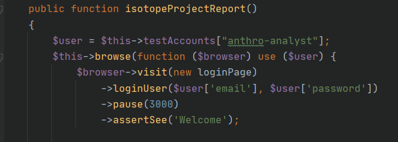

- **Understanding and calling the specimenPage**

Every new selector to be called must be called from the specimenPage.php, therefore every selector must be registered on specimenPage.php with usage name given for every selector. 

<strong><em>$browser->visit(new specimenPage)</em></strong>

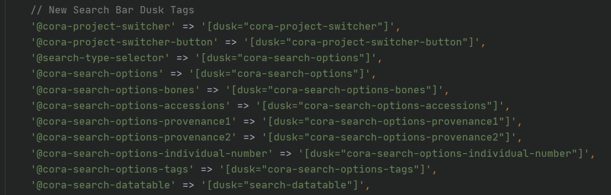

**Naming Groups**

•Every test script needs to be given a group name and also can be given with multiple names. Ex-

<strong><em>* @group Login</em></strong>

•To run different scripts, name the group with similar name.

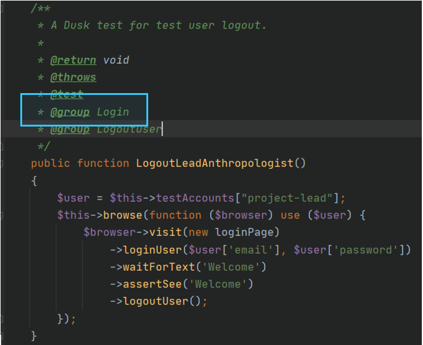

**Running Tests**

From the cora25 directory, run 

```console
php artisan dusk –group=Login  
```

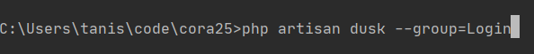


**Test Results**

Terminal keeps on updating on the progress of the ongoing tests. Calling multiple tests makes the terminal to show "./E/F". Dot represents that the test has been passed and an E represents that the test has an error and the F states that the test has been failed completely.

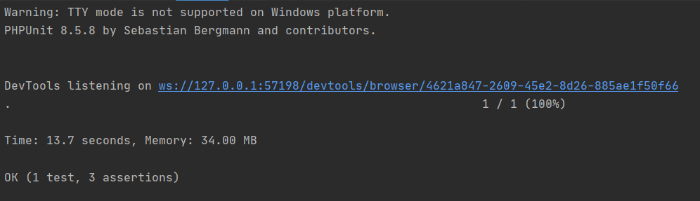

**Important Methods/Assertions to use**

- **click/select/press**

We use these methods to click on a button. Ex-

<strong><em>->press(‘@cora-search-options’)</em></strong> (Call using the name given to the dusk selector in specimenPage.php)

- **clickLink**

We use these methods to click on a link. Ex-

<strong><em>->clickLink(‘CIL 2003-116:G-04:X-56A:101’)</em></strong>

- **pause**

Pause is used to make the browser wait for the contents to load. Ex-

<strong><em>->pause(3000)</em></strong> (value in milliseconds)

- **assertsee**

To make the browser see the string in the page.Ex-

<strong><em>->assertSee(‘welcome’)</em></strong>

- **assertSeeLink**

To check if the given link is present in the page. Ex-

<strong><em>->assertSeeLink(‘CIL 2003-116:G-04:X-56A:101’)</em></strong>

- **Creating Browsers**

This is to make the browser open other window on clicking a link. Ex-

<strong><em>->clickLink(‘CIL 2003-116:G-01:X-232C:601’)</em></strong>

<strong><em>->pause(1000)</em></strong>

<strong><em>->driver->switchTo()->window(collect($browser->driver->getWindowHandles())->last());</em></strong>

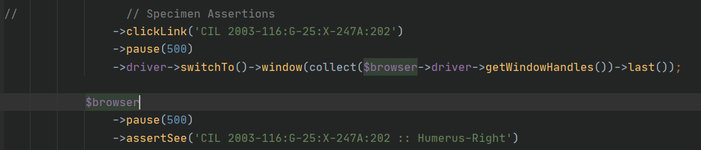

**Checking for Dusk Selectors**

- **Step 1**

Inspect the web page that needs to be added with the dusk selector.

- **Step 2**

Select Vue Dev Tools extension to change the inspect view for Vue Components.

- **Step 3**

Click on the “select target” button as shown in the gif below.

- **Step 4**

Click on the button which requires to be inspect using Vue Dev tools.

- **Step 5**

Check for the dusk name as shown in the gif.

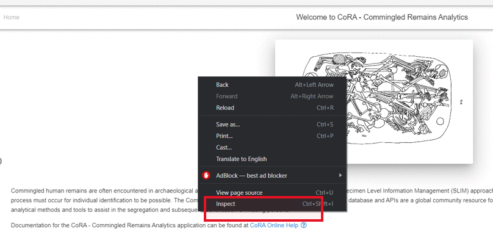

**Adding Dusk Selectors**

- **Identifying the component generating the button**

In the vue inspect window, identify the code structure to locate the vue component from which is being called.

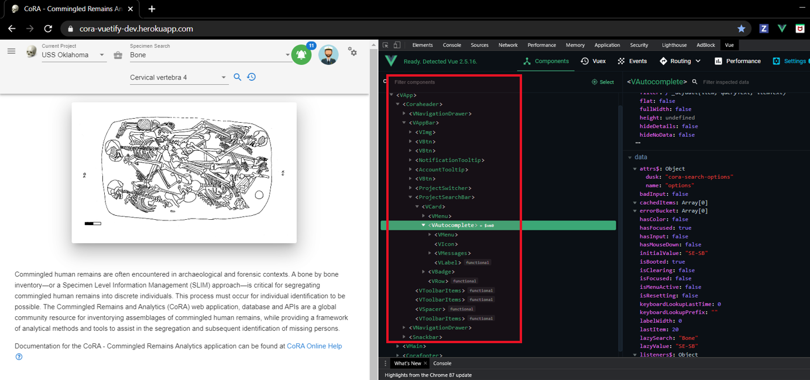

- **Non Dynamic**

Add dusk=”<name>”  for the  v-text-field creating the button.

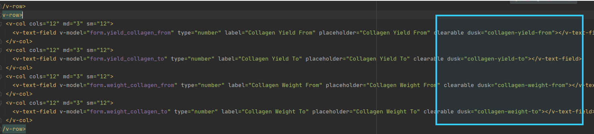

Run your local to inspect the button to make sure that the dusk selector given has been added.


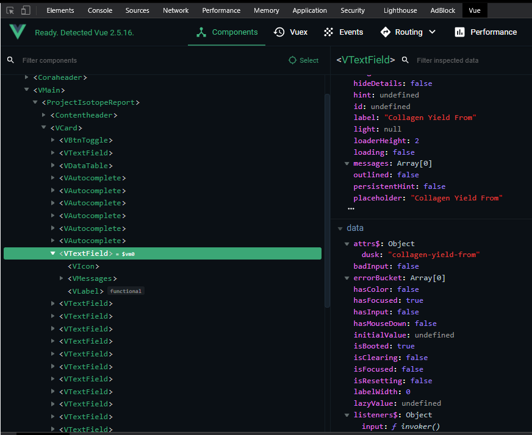


- **Dynamic**

1.	Identify the component calling the button producing list of dynamic results.
2.	:dusk="child.text"  added dusk to every list item for the button.
3.	:dusk=”item.text” added dusk to every list group item.


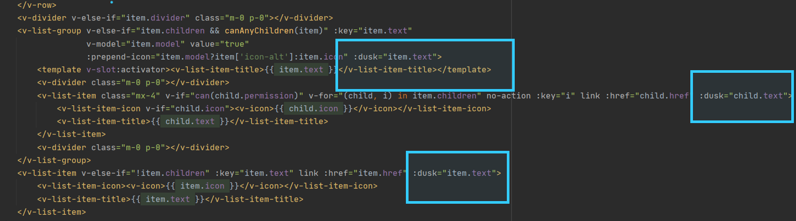

**Using the keyboard**

keys is used to point at a selector from where the keyboard input needs to be given. Ex-

<strong><em>->keys(‘@cora-search-options’, [‘{ARROW_DOWN}’])</em></strong>


## Resources

Official laravel website. [laravel]('https://laravel.com/')


