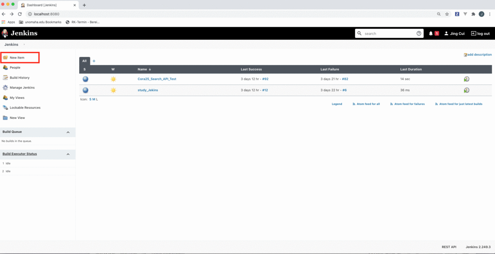
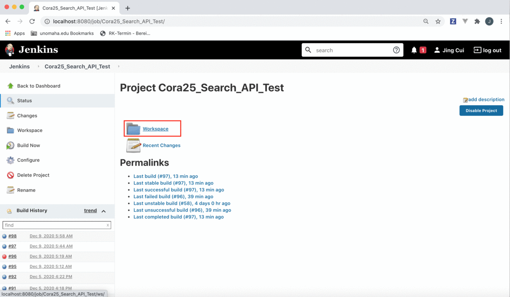

# TIPS FOR USING POSTMAN NEWMAN
## 1. Introduction
In order to understand Postman Newman and Jenkins better, I created this documentation for those classmates who are interested in learning Newman and Jenkins. In this documentation, I will cover a few parts, include install Newman, integrate Newman and Postman, install Jenkins, configure Jenkins, the usage of Jenkins, and I also share trouble shooting that I experienced. I hope this documentation will help you begin to use Newman faster or at least give you some ideas about Postman Newman and Jenkins.
## 2. Newman installation 
Before we start to install Newman, we have to know what Newman is. Newman is a command-line collection runner for Postman. It allows you to effortlessly run and test a Postman collection directly from the command-line. It is built with extensibility in mind so that you can easily integrate it with your continuous integration servers and build systems (resource from Postman Newman Documentation). 
### 2.1 Install Node.js and NPM
First of all, you need to make sure that you have installed Node.js and NPM (Node Package Manager). By checking if you have installed the newest version of Node.js and NPM, you can open your terminal/command line by typing 

```console
$ node --version 
$ npm --version
```

If you did not install node.js and npm, please look at the documentation of npm, the link is below:
https://docs.npmjs.com/downloading-and-installing-node-js-and-npm

### 2.2 Install Newman
Next, we are going to install Newman. To globally install Newman, on your terminal/command line by typing 
```console
$ npm install -g newman
```
After installing the Newman, you will see a similar message below. 


You can also check the Newman version by typing 
```console
$ newman --version
```
After install Newman, you may run the Newman on your terminal/command line. The format is below:
 ```console
 $ newman run link (collection url)
 ```
Here in our case, I will test Search Collection, which includes three folders, Specimen Search, DNA Search and Negative Tests. Here you do not need to worry about the meaning of “--environment”, I will cover it on the next part.  
```console
$ newman run "https://api.getpostman.com/collections/1225515800000?apikey=000000000" --environment "https://api.getpostman.com/environments/122551580000?apikey=0000000"
```
Now you will see the result below


## 3. Integrate Newman and Postman
This is your main options on how you can integrate between Postman and Newman. You can either generate a link which you will have to manually update every time you make any changes. Or you can export your collection as a JSON file and put inside git or wherever you like and make all your changes there. Or you can use the built-in API of postman and do that.

In our case, we will use the built-in API of postman. For the detailed information you can check the Postman Newman documentation. The link is below:
https://github.com/postmanlabs/newman#using-newman-with-the-postman-api

Typically, there are five steps, include 

Step 1, Generate API key

Step 2, Fetch a list of your collections from: https://api.getpostman.com/collections?apikey=$apiKey

Step 3, Get the collection link via its uid: https://api.getpostman.com/collections/$uid?apikey=$apiKey

Step 4, Obtain the environment URI from:
 https://api.getpostman.com/environments?apikey=$apiKey

Step 5, Using the collection and environment URIs acquired in steps 3 and 4, run the collection as follows:


Tips:

If you have trouble to understand how it works, there are many tutorial videos on YouTube to show you about using Newman with Postman API. Also, under the using Jenkins section, I will explain how to use the Postman API. In addition, I would like to share with one of my favorite tutorials about how to use Newman with the Postman API, the link is below:
https://www.youtube.com/watch?v=2Y5tl9ygbyk&t=896s.

## 4. Install Jenkins
Now it is the time to integrate everything by using Jenkins. Jenkins is a self-contained, open-source automation server which can be used to automate all sorts of tasks related to building, testing, and delivering or deploying software. Jenkins can be installed through native system packages, Docker, or even run standalone by any machine with a Java Runtime Environment (JRE) installed. 

There are at least two ways to install Jenkins on your mac OS system, includes using the Homebrew package manager or using Docker.

### 4.1 Option 1 Install Jenkins with Homebrew
Step 1: Install Homebrew
If you don’t already have the Homebrew package manager installed, you will first need to follow the installation steps from https://brew.sh/. 

You can check if Homebrew is already installed on your terminal.
 ```console
 $ brew --version
 ```
You should get back the Homebrew version if already installed. 


Step 2: Install Jenkins
Once Homebrew is installed, you can run the following command which will download and install the current Long-term support (LTS) version of Jenkins.

```console
 $ brew install jenkins-lts
 ```


Step 3: Start the Jenkins server

The next step is to actually start the Jenkins server. You can do that with this command:

 ```console
 $ brew services start jenkins-lts
 ```
This will start the Jenkins server in a few seconds. You can check if it is properly working by visiting http://localhost:8080/

Step 4: Get the installation password
To get the password needed to run the installation process, just check the content of the file mentioned on the screen.


Now, let’s use the cat command directly in the terminal, for example (replace with your own file path):
 ```console
 $ cat /Users/valentin/.jenkins/secrets/initialAdminPassword
 ```


### 4.2 Option 2: Install Jenkins with Docker
Step 1: Install Docker
This step requires that you have Docker installed on your system. If this is not the case, make sure you download and install Docker Desktop

Step 2: Run the Jenkins Docker image
Once Docker is up-and-running, you can open a new terminal window and paste the following command:
 ```console
 $ docker run -p 8080:8080 -p 50000:50000 -v ~/jenkins_home:/var/jenkins_home jenkins/jenkins:lts
 ```
This command will download the current Long-term support (LTS) version of Jenkins and will spin-up a new Docker container. You can learn more about the different options available at the official Jenkins Docker documentation page.

Step 3: Wait for the installation to complete

Initially, it should take a few minutes to download and install, but you should soon see in the terminal no longer displaying anything new.

This indicates that the container is now working and waiting for you to complete the Jenkins installation.

Step 4: Get the installation password

Open a new browser window and go to http://localhost:8080/. You will be asked to input the installation password that should still be visible in the terminal.


## 4.3 Start and Stop Using Jenkins

It is important to know how to start and stop Jenkins. For those who choose option 1 Install Jenkins with Homebrew, to stop the Jenkins server, open any terminal window and enter the command:
 ```console
 $ brew services stop jenkins-lts
 ```
To start the Jenkins server again, use the command:
 ```console
 $ brew services start jenkins-lts
 ```
If you are using Docker (option2 Install Jenkins with Docker), you can go to the terminal window where you started the Docker container and hit Command + C. This will stop the process running the Docker container thus stopping Jenkins. If you need to start Jenkins again, run the exact same command as when you have installed Jenkins.

## 5. How to Configure Jenkins
Once you have installed Jenkins, our final setup step is configure Jenkins.

Step 1 Install plugins

Jenkins is composed of multiple components called plugins. The next step asks you which plugins you would like to install. Just install the suggested plugins. Don’t worry about this – you can easily add or remove plugins later. Just install the suggested plugins.


Step 2 Create a Jenkins User

The next step is to create a Jenkins admin user. Make sure you write down and remember the username and password, because you will need them later.


Step 3: Configure the Jenkins URL

The final step is to configure the URL for the Jenkins server. This would be prefilled for you. So, all you need to do is to click the button to save and continue.
Now the server is configured, and it is ready for us to use. 

Next you will login the Jenkins with using the account information that you just created. 


Now it is time to use Jenkins for the Postman testing.


## 6. Using Jenkins 
### 6.1 Set up Jenkins
Now it is the time for using Jenkins. I will give you an example to show how Jenkins works by testing Search collection. First of all, you need to create a new job by clicking on the “New Item” link on the left sidebar > Select a “Freestyle Project” from the options > Name your project.


Next, we will add a build step in the project. If you are using Mac as I am, you will choose “Execute shell”. If you are using Windows, you should choose “Execute Windows batch command”. And then click “save” button. 

Then we need to double check if we install npm and newman. So under the "Execute shell", you input the command and save the "Configure". 
 ```console
 $ node --version 
 $ npm --version 
 $ newman --version 
 ```


Now I will click “Build Now”. After it executed, you will see a blue circle in from of the test number, which means the test was passed. You can also click the blue circle, which will bring you to the Console Output. All of the test results you will see it. Here we can see the node, npm and newman version, and it will also tell you the test was finished, and the result is “SUCCESS”.


If you did not see the result succeed, instead you will find the result which is similar as below. 


It means the three tools (npm, node and newman) were not installed on your machine. You may be curious about at the very beginning, you have already installed. Do not worry it happens to many people. Typically, there are two solutions, if you have this issue like me, you can check the trouble shooting section. 

Next, let us go back to the Postman.  As I mentioned before, I use the built-in API of postman to integrate between Postman and Newman. In our case, we do have environment, which include the variable of base_url, token and others. Now I will copy the link that I used on the terminal for running Newman and paste it under the Build. 


Just in case you are curious about the meaning of these code, I will explain it. Here I am using Postman API to retrieve this collection which belongs to my personal account providing this API key. Then in the same way, I’m providing an environment as well. And the environment can be retrieved too. To be detailed, the http is the Search collection url, and then the number begins with 122 is my uid and then after the question mark is my api key. Same as the next line, the environment url first, then the uid and api key.

If you still have questions or confused, you can check the Postman Newman documentation (https://github.com/postmanlabs/newman#using-newman-with-the-postman-api ), or the video that I shared with you under the Integrate Newman and Postman section.
Now I will save the rerun it, no surprise, I will see all the requests passed. 


Here we can see a form showing how many requests, assertions and etc. that you have executed, and you can also see the run time, and other information. It looks good to check the result from the Console Output, but here is a problem if you have many assertions, requests, when something fails, it is not very convenient to go and check the console and see exactly what happened there.  

### 6.2 Using Reporters with Newman
In order to solve this problem, Jenkins can show reports, and you are able to access a report by using interface. If you look at the Newman documentation, one of the important things you can do with Newman is to using reporters. There are different reports, cli, json, junit, progress and etc. Here I choose cli and junit as our reporters. Typically, I need to select reporters first. Next, we should tell the Newman where your report put by using CLI Option. Here I will export the report 4.xml under newman folder. 


After click “save”, I will run the command again by clicking “Build Now”. No surprise, the test passed and now I will click the “Workspace” and select “newman” folder. Now I can see the reportr.xml has already there. 


Now I will go back to the configure, I will configure this job to publish this report, so Newman generated this report, and saved the file at somewhere (newman folder), but Jenkins still has no idea such a file has been generated. So, we need to configure Jenkins to understand it. So, I am going to click "post-build actions”.  Then input the test report XMLs, in my case, I have newman/report4.xml that I just generated. And then save it.


Next, I will run the test again by click “Build Now”. Now I can check report of the test result.


It is common that the test sometimes failed. You will get the information about the failed detailed information by checking report. For example, I made a little change on my search collection, and I uploaded the two collections include environment on GitHub and run it on Jenkins. The test failed no surprise, now I can see exactly which test failed and what happened to this test by looking at “Stacktrace” and “Error Message”. 


### 6.3 Using Collections in a git Repository
We can also use the collection and environment saved in a git repository on GitHub to run the API test on Jenkins. First of all, you have to upload the collections on GitHub. Still in our case, I export the search and environment collections from Postman and push them on the repository of Newman_Cora25_Search_Test. 

Next, I click the button “Code”, and make a copy of the URL. 


Then go back to the Jenkins, and under the “Source Code Management”, select “Git” and input the Repository URL that I just copied from the GitHub, and later select “master” as the branch and save it. 


Next go back to the “Configure” and replace the search and environment collections URL to the collection name that shown on GitHub repository and save it.


Now it is the time to run the test again, this time you can check the "Test Result" or you can also check the "Console Output", you will see the Newman is testing the collections from GitHub repository that we just configure it.


## 7. Trouble shooting
Newman is a powerful tool for running automatic test. It is built with extensibility in mind so that we can easily integrate it with our continuous integration servers and build systems. I do enjoy the learning process about Newman and Jenkins, but I also met a few issues. I believe that it is important to share with you especially when you might have the same issues and my experience will give you some ideas or help you save same time. 

### 7.1 Using a wrong environment collection URL 
When I used the Postman API to integrate Postman and Newman, I used a wrong environment collection, which brought errors that Newman could not find any environment values. The result is obvious that almost all of the test failed. 

In our case, I called the environment “development” in my personal workspace. At the same time, our team workspace we also have an environment called “development”. As a result, when I obtained the environment URL, I used the wrong one. 


So, if your environments have same name, you need to choose carefully. My method of distinguishing the two environments is checking the “owner”. It works for me. But I believe that the better solution is avoiding of givng the same environments name. 

### 7.2 Jenkins could not find node.js
Another issue that I met is Jenkins is unable to find node.js after checking the node.js version on the "Execute Shell".


There are two solutions, but only one works for me. Typically, I installed node.js plugin for Jenkins. Plugins are the primary means of enhancing the functionality of a Jenkins environment to suit organization- or user-specific needs. There are over a thousand different plugins which can be installed on a Jenkins controller and to integrate various build tools, cloud providers, analysis tools, and much more. There are a few steps about Jenkins integration for NodeJS & npm packages.

Step 1 We need to download the newest version of nodejs.hpi and install it from the Manage Plugins menu or install this plugin directly from the Plugins Update Center. 

Step 2 Go to the global Jenkins configuration panel and add new NodeJS installations.

Step 3 On the "Build Environment" section, you will be able to pick one of the NodeJS installations to provide its bin/ folder to the PATH.


On the "Build" section, you will be able to add a "Execute NodeJS script".


Tips:

If you still have this issue, you could look at the documentation about Plugins on Jenkins. The link is below https://plugins.jenkins.io/nodejs/ . 

## 8. Summary 

In summary, just as the Postman Learning center said, “Postman contains a full-featured testing sandbox that lets you write and execute JavaScript based tests for your API. You can then hook up Postman with your build system using Newman, the command line collection runner for Postman. Newman allows you to run and test a Postman Collection. Newman and Jenkins are a perfect match”. It is not exception in our case. I do enjoy learning Newman and Jenkins. Hopefully my experience will help you a little bit.   

## 9. Resources
1. Postman Newman documentation: https://github.com/postmanlabs/newman#using-newman-with-the-postman-api

2. Jenkins documentation about Plugins: https://www.jenkins.io/doc/book/managing/plugins/

3. Jenkins documentation about Plugins -- node.js: https://plugins.jenkins.io/nodejs/ 

4. Postman Integrating with Jenkins: https://learning.postman.com/docs/running-collections/using-newman-cli/integration-with-jenkins/

5. How to install Jenkins: https://coralogix.com/log-analytics-blog/how-to-install-and-configure-jenkins-on-the-mac-os/


