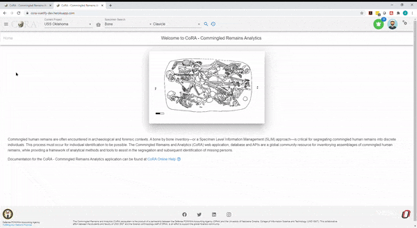
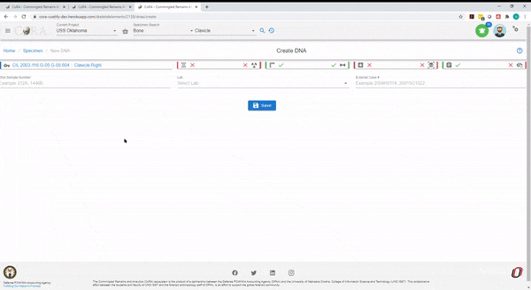
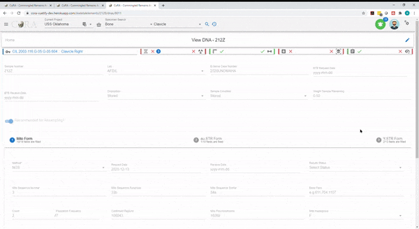
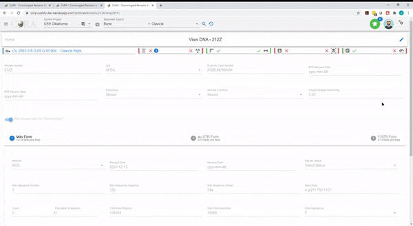

## New DNA Profile

The New DNA profile allows a user to create a DNA profile for a specimen. 

On the top search options, choose the following: 

1. Current Project
2. Specimen Search 
3. The third field is dependent on which field you choose in Specimen Search. If you choose Bone then this field will ask you to choose a bone to search for. 
4. Click the magnifying glass to initiate the search
5. Click on the Key field on the left most column to choose the specimen that you would to create a new DNA profile for. 
6. At the Skeletal Elements page, click on the action button (3 vertical dots) on the right corner of the screen (next to the pencil icon)
7. Click on DNA Profile

This will begin the DNA profile creation. 

##### New DNA

To create a new DNA Profile, you must enter the required fields listed below.

***The bolded fields are required.***

- **DNA Sample Number**
- **Lab**
- External Case Number

Click Save to move on to the next screen. 

#### Edit DNA Form

Click the pencil icon on the top right corner to edit the DNA form. 

Update the following fields if necessary:

- Lab
- External Case Number
- BTB Request Date
- BTB Receive Date
- Disposition
- Sample Condition
- Weight Sample Remaining
- Recommended for Resampling? (Toggle Button)

Click on Save if any of the fields were updated

##### DNA Mito Form

Click the pencil icon on the top right corner to update the DNA Mito Form. 

There are 14 fields that can be filled out and they are:

***The bolded fields are required.***

- **Method**
- Request Date
- Receive Date
- Results Status
- Mito Sequence Number
- Mito Sequence Subgroup
- Mito Sequence Similar
- Base Pairs
- Count
- Population Frequency
- Confirmed Regions
- Mito Polymorphisms 
- Mito Halpogroup

Click Save when all necessary fields have been updated. 

You will be able to see how many fields that were completed under Mito Form. You will see X/14 fields are filled. 

##### DNA au-STR Form

Click on the au-STR Form Tab to the right of Mito Form to update the au-STR DNA fields. 

Click the pencil icon on the top right corner and then click on the au-STR tab to update the DNA au-STR Form.  

There are 10 fields that can be filled out and they are:

***The bolded fields are required.***

- **Method**
- Request Date
- Receive Date
- Results Status
- auSTR Sequence Number
- auSTR Sequence Subgroup
- auSTR Sequence Similar
- Number of Loci
- Loci
- MCC Date

Click Save when all necessary fields have been updated. 

You will be able to see how many fields that were completed under au-STR form. You will see X/10 fields are filled.

##### DNA Y-STR Form

Click on the Y-STR Form Tab to the right of au-STR Form to update the Y-STR DNA fields. 

Click the pencil icon on the top right corner and then click on the Y-STR tab to update the DNA Y-STR Form.  

There are 13 fields that can be filled out and they are:

***The bolded fields are required.***

- **Method**
- Request Date
- Receive Date
- Results Status
- Y-STR Sequence Number
- Y-STR Sequence Subgroup
- Y-STR Sequence Similar
- Number of Loci
- Loci
- Count
- Population Frequency
- Y Halpogroup
- MCC Date

Click Save when all necessary fields have been updated. 

You will be able to see how many fields that were completed under au-STR form. You will see X/13 fields are filled.

