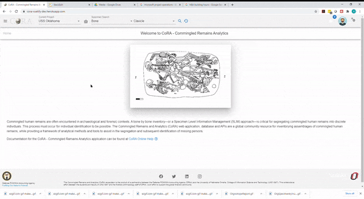
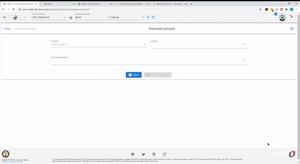
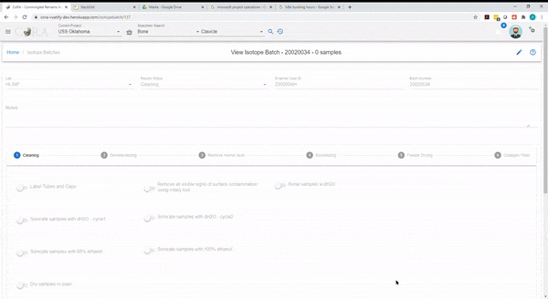
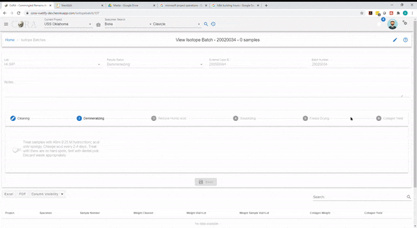
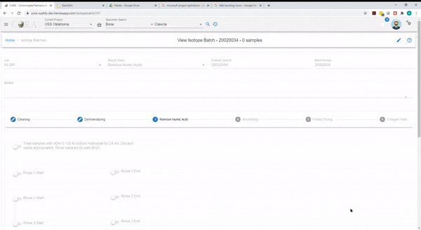
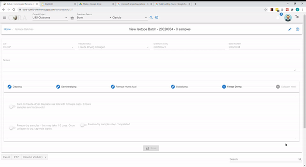
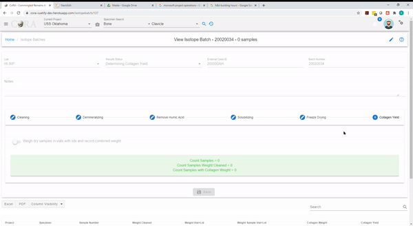

### New Isotope Batch

**You must be logged in as an Isotope Analyst in order to create a new Isotope Batch.**
       
A new Isotope Batch can be created by navigating to Left Sidebar Menu -\> Isotope -\> New Isotope Batch.

This will allow an Isotope Analyst track their progress throughout the cycle of creating a new Isotope Batch. This functionality will allow the Isotope Analyst document at which step the Isotope Batch is currently in and tracks its' status. 

#### Create Isotope Batch Page

To create a new Isotope Batch, you must enter the required fields listed below.

***The bolded fields are required.***  

The fields to create a new Isotope Batch are: 

- **Lab**
- External Case # 
- **Isotope Batch Number**

#### Associate Isotopes Page

The fields to Associate Isotopes with Isotope Batch are:

- Projects
- Isotopes
- Associated Isotopes

Once the necessary information is filled out, click start processing

##### Cleaning Tab

Click the pencil icon on the top right corner to edit the Cleaning fields. 

Each toggle switch must be enabled before moving forwards to the next tab (Demineralizing)

Toggles must be enabled for the following processes:
- Label Tubes and Caps
- Remove all visible signs of survace contamination using rotary tool
- Rinse samples w/dH20
- Sonicate samples with dH20 - cycle 1
- Sonicate samples with dH20 - cycle 2
- Sonicate samples with 95% ethanol
- Sonicate samples with 100% ethanol
- Dry samples in oven

Click Save

After the toggles have been enabled and saved, you will see "Start Date" for Sonicate samples with dH20 - cycle 1, Sonicate samples with 95% ethanol, Dry samples in oven, Sonicate samples with dH20 - cycle 2, Removed cooled samples from tubes, weigh, and return. 

***Note: Dates cannot be edited, the dates are taken from when the toggle switch was enabled.***

After you save the above one new field will appear, enable this toggle once completed and then click save

- Remove cooled samples from tubes, weigh, and return

Click Save

***If you are not able to go to the next tab, please check and ensure all fields and toggles are filled out properly*** 

##### Demineralizing Tab

Click the pencil icon on the top right corner to edit the Demineralizing fields. 

Each toggle switch must be enabled before moving forwards to the next tab (Remove Humic Acid)

Toggle must be enabled for:
- Treat samples with 40ml 0.25 M hydrochloric acid until spongy. Change acid every 2-4 days. Treat until there are no hard spots; test with dental pick. Discard waste appropriately.

click Save

Two new fields will appear, click the pencil icon again to edit to enable the toggle switches

Toggles must be enabled for:
- Treatment of samples with 40ml 0.25 M hydrochloric acid complete

***Note: Dates cannot be edited, the dates are taken from when the toggle switch was enabled.***

Click Save

One new field will appear, click the pencil icon again to edit to enable the toggle switch

Toggles must be enabled for:
- Rinse demineralized samples 3x with dH20

Click Save

***You will be moved to the next tab, "Remove Humic Acid", if you are not able to go to the next tab, please check and ensure all fields and toggles are filled out properly***

##### Remove Humic Acid Tab

Click the pencil icon on the top right corner to edit the Remove Humic Acid fields. 

Each toggle switch must be enabled before moving forwards to the next tab (Solubilizing). 

Toggles must be enabled for:

- Treat samples with 40ml 0.125 M sodium hydroxide for 24 hrs. Discard waste appropriately. Rinse samples 5x with dH20. 
- Rinse 1 Start
- Rinse 1 End
- Rinse 2 Start
- Rinse 2 End
- Rinse 3 Start
- Rinse 3 End
- Rinse 4 Start
- Rinse 4 End
- Rinse 5 Start
- Rinse 5 End

Click Save

One new field will appear, click the pencil icon again to edit to enable the toggle switches. 

***Note: Dates cannot be edited, the dates are taken from when the toggle switch was enabled.***

- Treatment and Rinse Completed

Click Save

***You will be moved to the next tab, "Solubilizing", if you are not able to go to the next tab, please ensure all fields and toggles are filled out properly***

##### Solubilizing Tab

Click the pencil icon on the top right corner to edit the Solubilizing fields. 

Each toggle switch must be enabled before moving forwards to the next tab (Freeze Drying). 

Toggle must be enabled and fields entered for:

- Clean vials and lids. Label. 
- Add 15ml pH 3 dH20 to samples and cover tubes with double layer of plastic wrap. Cap tightly. 
- Place capped tubes in oven for 24 hours. 
- Centrifuge tubes and transfer supernatant into PTFE beakers. Place beakers in oven to evaporate
- Number of Acid-Heat Treatments
- Number of Collagen Transfers
- Close vials and freeze until solid. Tilting vials while freezing can help prevent cracking. 

Click Save

***You will be moved to the next tab, "Freeze Drying", if you are not able to go to the next tab, please ensure all fields and toggles are filled out properly.***

##### Freeze Drying Tab

Click the pencil icon on the top right corner to edit the Freeze Drying fields. 

Each toggle switch must be enabled before moving forwards to the next tab (Collagen Yield).

Toggles must be enabled for:  

- Turn on freeze-dryer. Replace vial lids with Kimwipe caps. Ensure samples are frozen solid. 
- Freeze-dry samples - this may take 1 - 3 days. Once collagen is dry, cap vials tightly. 
- Freeze-dry samples step completed

Click Save

***Note: Dates cannot be edited, the dates are taken from when the toggle switch was enabled.***

***You will be moved to the next tab, "Collagen Yield", if you are not able to go to the next tabl, please ensure all fields and toggles are filled out properly.***

##### Collagen Yield Tab

Click the pencil icon on the top right corner to edit the Collagen Yield fields. 

Each toggle switch must be enabled before the Isotope Batch can be saved. 

Toggle must be enabled for: 

- Weigh dry samples in vials with lids and record combined weight. 

Click Save 

You should see "Result Status" field on the top showing that it is Completed. 

