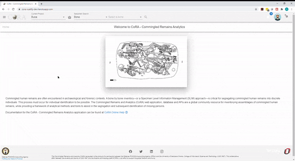
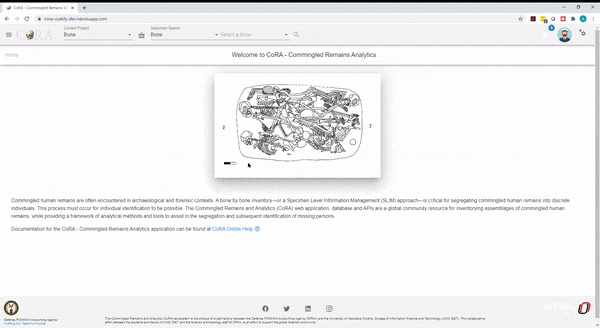
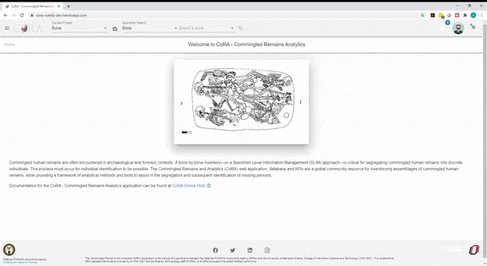
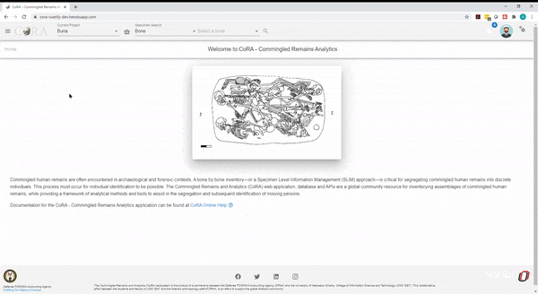
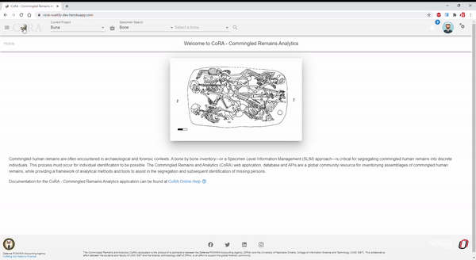
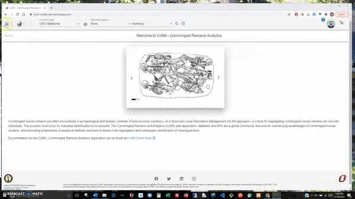

## Org Reports

* [Org Reports](#org-reports)
  * [DNA Austr Report](#dna-austr-report)  
  * [DNA Mito Report](#dna-mito-report)  
  * [DNA Ystr Report](#dna-ystr-report) 
  * [Isotopes Report](#isotopes-report) 
  * [Specimen by Individual Number Details Report](#specimen-by-individual-number-details-report)  
  
  
### Org Reports

The Org Reports dashboard is accessible by organization admin only. You can expand/collapse all report tabs or individual tabs and also drag and rearrange the tab arrangement. This arrangement is saved even after the user logs out. This state is saved in your local storage until browser cache is cleared. Each report pane holds an image of its respective sample report showing column names of that report. 

### DNA Austr Report

The DNA Austr Report allows a user to select by Projects, Lab, Priority, Result Status, Austr Sequence Number, and Austr Sequence Subgroup. 

***There are no fields required to generate the report.***

The search fields that are available are: 

* Projects
* Lab
* Priority
* Results Status
* Austr Sequence Number
* Austr Sequence Subgroup
* Request Dates From
* Request Dates To
* Receive Dates From
* Receive Dates To

The report will return the following results if available: 

* Project
* Key
* Bone
* Side
* Bone Group
* Individual Number
* Sample Number
* Austr Sequence Number
* Austr Sequence Subgroup
* Austr Sequence Similar
* Austr Result Status
* Austr Request Date
* Austr Receive Date

### DNA Mito Report

The DNA Mito Report allows a user to select by Projects, Lab, Priority, Result Status, Mito Sequence Number, and Mito Sequence Subgroup. 

***There are no fields required to generate the report.***

The search fields that are available are: 

* Projects
* Lab
* Priority
* Results Status
* Mito Sequence Number
* Mito Sequence Subgroup
* Request Dates From
* Request Dates To
* Receive Dates From
* Receive Dates To

The report will return the following results if available: 

* Project
* Key
* Bone
* Side
* Bone Group
* Individual Number
* Sample Number
* Mito Sequence Number
* Mito Sequence Subgroup
* Mito Sequence Similar
* Mito Result Status
* Mito Request Date
* Mito Receive Date

### DNA Ystr Report

The DNA Ystr Report allows a user to select by Projects, Lab, Priority, Result Status, Ystr Sequence Number, and Ystr Sequence Subgroup. 

***There are no fields required to generate the report.***

The search fields that are available are: 

* Projects
* Lab
* Priority
* Results Status
* Ystr Sequence Number
* Ystr Sequence Subgroup
* Request Dates From
* Request Dates To
* Receive Dates From
* Receive Dates To

The report will return the following results if available: 

* Project
* Key
* Bone
* Side
* Bone Group
* Individual Number
* Sample Number
* Ystr Sequence Number
* Ystr Sequence Subgroup
* Ystr Sequence Similar
* Ystr Result Status
* Ystr Request Date
* Ystr Receive Date
* 

### Isotopes Report

The Isotope Report allows a user to select by project, lab, result status, and batch ID. 

***There are no fields required to generate the report.***

The search fields that are available are: 

 - Accession Number
 - Provenance 1
 - Provenance 2
 - Designator
 - Batch ID
 - Lab
 - Results Status
 - Collagen Yield From/To
 - Collagen Weight From/To
 - Carbon Weight From/To
 - Nitrogen Weight From/To
 - Oxygen Weight From/To
 - Sulfur Weight From/To
 - Carbon Percentage From/To
 - Nitrogen Percentage From/To
 - Oxygen Percentage From/To
 - Sulfur Percentage From/To
 - Carbon-to-Nitrogen Ratio From/To
 - Carbon-to-Oxygen Ratio From/To

The report will return results of of the following if it is available: 
 - Project
 - Key
 - Bone
 - Side
 - Bone Group
 - Individual Number
 - Sample Number
 - Collagen Yield
 - Collagen Weight
 - Carbon Weight
 - Nitrogen Weight
 - Oxygen Weight
 - Sulfur Weight
 - Carbon Percentage
 - Nitrogen Percentage
 - Oxygen Percentage
 - Sulfur Percentage
 - Carbon-to-Nitrogen Ratio
 - Carbon-to-Oxygen Ratio

### Specimen by Individual Number Details Report

The Specimen by Individual Number Details Report allows a user to select by project, individual number or bone. Either individual number or bone is required to run the report. If project is blank, the report will retrieve by individual number or bone for all projects. 

***The bolded fields are required. The user is required to select a bone or an individual number for this report.***

The search fields that are available are: 

 - Projects
 - **Individual Number**
 - **Bone**
 - Side

The report will return results of of the following if it is available: 
 - Project
 - Key
 - Individual Number
 - Bone
 - Side
 - DNA Sample Number
 - DNA Sequence Number
 - Traumas
 - Pathologies
 - Anomalies

