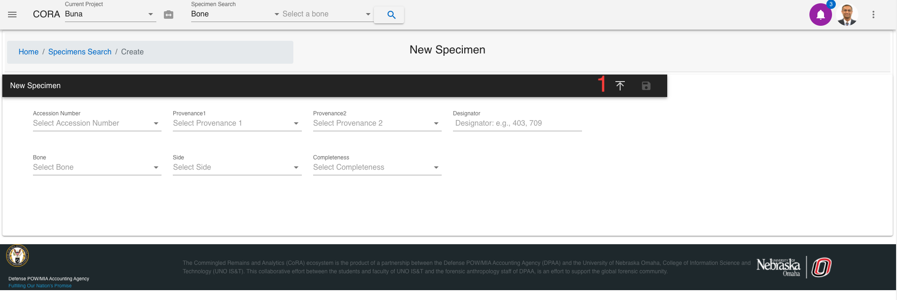
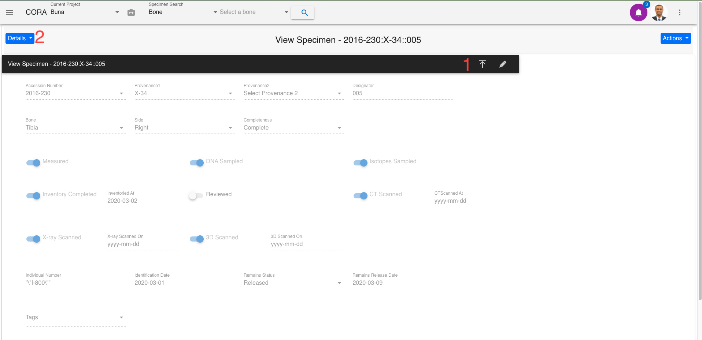
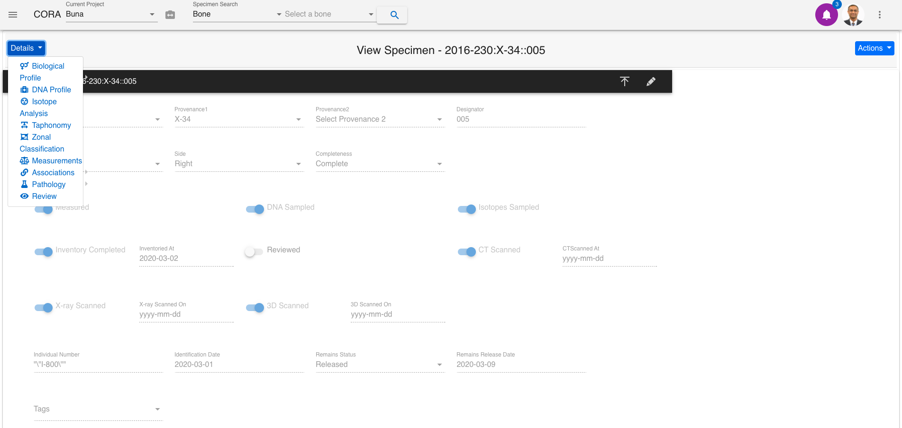
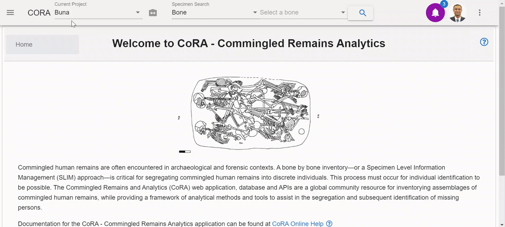
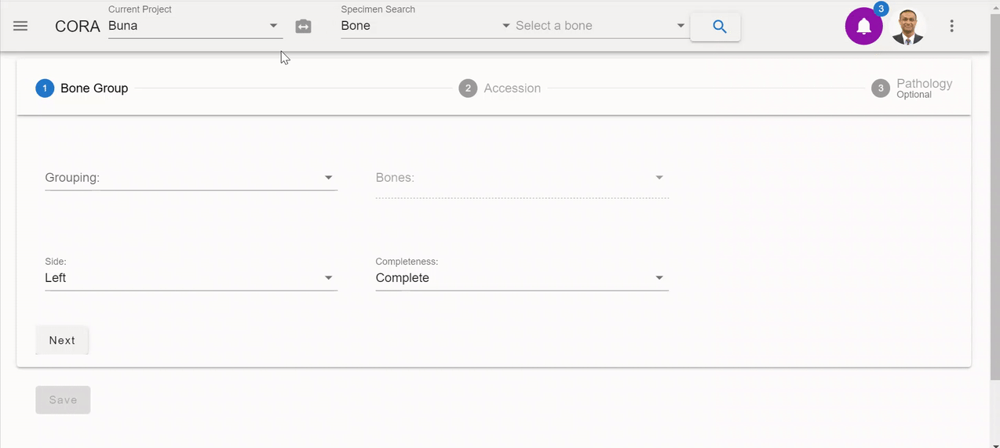

## New Specimen

* [New Specimen](#new-specimen)
* [Details Section](#details-section)
    * [Biological Profile](#biological-profile)
    * [DNA Profile](#dna-profile)
    * [Isotope Analysis](#isotope-analysis)
    * [Taphonomy](#taphonomy)
    * [Zonal  Classification](#zonal)
    * [Measurements](#measurement)
    * [Association](#association)
    * [Pathology](#pathology)
    * [Review](#review)
    * [New Bone Group](#new-bone-group)

### New Specimen
       
A new specimen can be created by navigating to Left Sidebar Menu -\> Specimen -\> New Specimen.
The screen is shown below. The toolbar shows the following options.

***The bolded fields are required.***  

The fields to create a new specimen are:

- **Accession**
- Provenance Number 1
- Provenance Number 2
- **Designator**
- **Bone**
- **Side**
- **Completeness**

Below are some fields with some validation rule

Once these details are filled and the specimen is saved, a new specimen number is generated and the user is navigated to the below screen. The screen is in View state and user can edit it by clicking on the edit icon.

1.  The toolbar shows the options to the Edit/Save button and the
    Expand/Collapse button.

2.  The Details button lists all specimen associations.

Below is the list of Specimen associations mentioned under the Details button.
Each option is explained in the following section.

General

This tab has options for users to select the lines per page to control the
numbers of rows of data displayed for views with tables. The user can choose to display the Welcome Screen on startup when the user logs into the application.
Users can choose to have help slide out the right sidebar with help on screens such as Skeletal Elements measurements, zones and methods.

## Details Section

### Biological Profile

Biological Profile shows sub-options as Age, Ancestry, Sex, and Ancestry. User can add, edit or delete a method. 

Age:

Sex:

Ancestry:

### DNA Profile

The DNA Profile screen displays the following elements about a bone:

- DNA Sample Number
- Lab
- External Case #
- BTB Request Date
- BTB Results Date
- Disposition
- Sample Condition
- Weight Sample Remaining

On this screen, you can also view the "Mito", "auSTR", and "Y-STR" forms and navigate by clicking the form name or by clicking the Next button.

### Isotope Analysis

The 'Create Isotope' section allows to create a isotope for the given bone. This section has the following elements. 
- Lab
- External Case # 
- Isotope Sample Number

After you create the Isotope, you will receive the "Isotope Add Successful" message. By selecting the sample number, the Isotope screen pops up. Click on the Edit button to edit the information under each section.CLick on the Save button under each section saves the information and navigates the user to the next section of information. All the updated information can be saved at once by clicking on the ‘Save All’ button.

### Taphonomy

The Taphonomies section allows you to view Taphonomies for the given bone. To add Taphonomy, click the pencil icon to edit and select Taphonomies. Click the Save icon to save the changes.

### Zonal Classification

The Zones pane displays various zones of the bone. For example below are the following zones about the bone Radius:

- Lateral half of radial head
- Medial half of radial head
- Lateral portion of distal articulation
- Medial portion of distal articulation
- Proximal diaphysis
- Lateral half of diaphysis
- Medial half of diaphysis
- Superior half of distal third
- Lateral distal third
- Medial distal third
- Styloid process

These fields are read only - to edit then click the pencil icon. Multiple zones can be selected. All the listed Zones can be selected or deselected by clicking the ‘Select all’ check box. Click the save icon to save the changes.

### Measurements

The measurements pane displays various measurements of the given bone. The following are the measurements for a given bone Radius: 
- Rad_01 Maximum Length 
- Rad_02 Maximum Diameter of the Radius at Midshaft 
- Rad_03 Minimum Diameter of the Radius at Midshaft 
- Rad_04 Maximum Diameter of the Head 
- Rad_05 Anterior-Posterior (Sagittal) Diameter at Midshaft 
- Rad_06 Medial-Lateral (Transverse) Diameter at Midshaft 
- Rad_07 Maximum Diameter at the Radial Tuberosity 
- Rad_08 Maximum Diameter of the Diaphysis Distal to the Radial Tuberosity 
- Rad_09 Minimum Diameter of the Diaphysis Distal to the Radial Tuberosity 
- Rad_10 Breadth of the Distal Epiphysis

These fields are read only - to edit, click the pencil icon. the minimum value, threshold limit and maximum limit are indicated to the user through the alerts. Click the save icon to save the changes or ‘Undo’ icon to undo all the changes made. The blue badge on top of the bone name indicates the number of measurements filled out of the total number of available measurements for that particular bone.  The pane can be expanded or collapsed by clicking on the arrow icon.

### Association

There are four types of associations. Process of adding each association is shown below. After the association is added, refresh the page to see the Details button updated. The details button opens a data table of all available associations under that specimen.

>   a. PAIR MATCHING

>   b. REFITS

>   c. ARTICULATIONS

>   d. MORPHOLOGY

### Pathology

Pathology, Trauma and Anomaly can be accessed on one screen as different tabs. The user can create a new item by clicking on the create button. 

### Review

The review tab is a pane which displays all other sub reports in one area. All reports are editable in the pane. For information on individual reports - see their detailed documentation.

### New Bone Group

To add a new bone group - click "New Bone Group" on the left navbar. You will be taken to the "New Bone Group Page". Here you can create a superclass which can contain multiple specimens.

The fields to create a new bone group are:

- Bone Group
    - **Grouping**
    - Bones
    - Side (defaulted to 'Left')
    - Completeness (defaulted to 'Complete')
- Accession
    - **Accession**
    - **Provenance 1**
    - Provenance 2
    - **Starting Designator**
- Pathology
    - Trauma
    - Pathology
    - Taphonomy
    
The bolded fields are required. Once you have created a new bone group, you can edit the fields and click "Save" to update the bone group.

