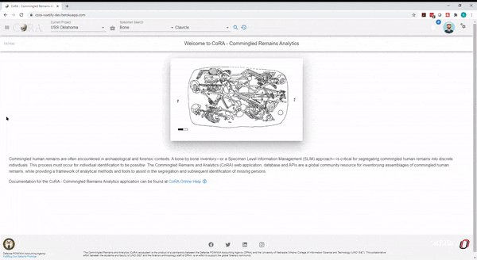

### New via Bone Group
       
A new specimen can be created by "Create Specimen by Bone Group" by navigating to Left Sidebar Menu -\> Specimen -\> New via Bone Group.

To create a new specimen by bone group, you must enter the required fields listed below.

***The bolded fields are required.***  

The fields to create a new Specimen by Bone Group are:

#### First Screen: Bone Group

- **Bone Group**
- **Side**
- **Completeness**

#### Second Screen: Accession

- **Accession**
- Provenance 1
- Provenance 2
- **Designator**

#### Third Screen: Pathology (Optional)

- Taphonomies
- Pathologies
- Traumas

